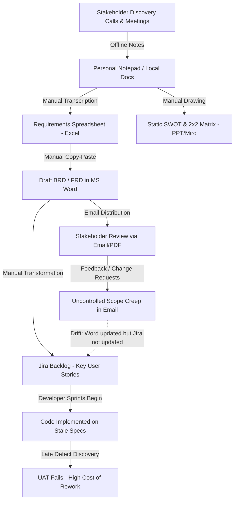
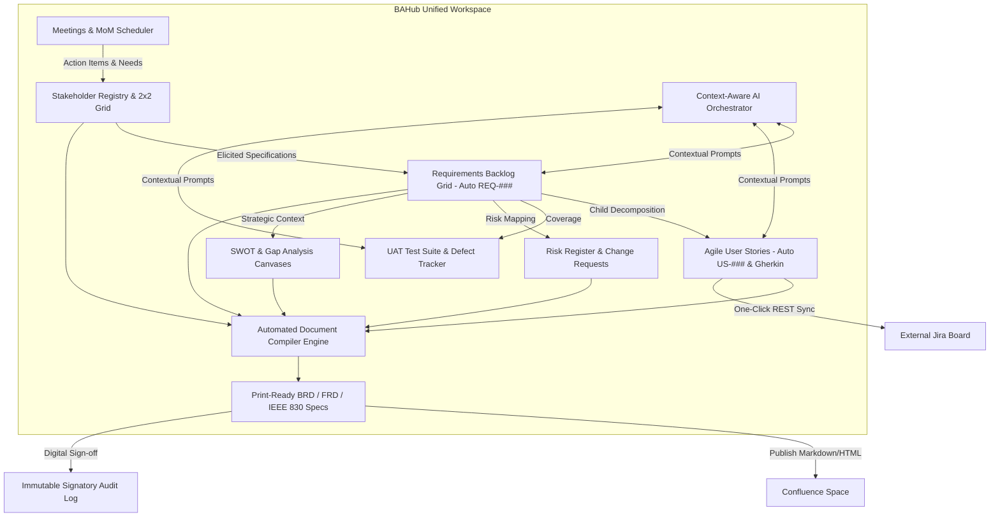

# BAHub — Enterprise Business Case & Investment Justification
**Document Reference:** BC-BAHUB-2026-V1  
**Project Name:** BAHub (The AI-Powered Business Analyst Workspace)  
**Author:** Senior Business Analyst / Lead Solution Analyst  
**Stakeholder Audience:** Executive Leadership, Head of Product, VP of Engineering, Director of Digital Transformation  
**Status:** Approved Baseline  

---

## 1. Executive Summary

Modern enterprise IT and product engineering organizations operate at high sprint velocity, yet the upstream **Requirements Engineering and Business Analysis (BA) lifecycle** remains heavily manual, siloed, and disconnected. Business Analysts spend between 15% and 25% of their total sprint capacity manually collating requirements across disconnected tools (spreadsheets, slide decks, wiki pages, emails, and ticket trackers). This fragmentation creates "Requirements Drift," where implemented code deviates from approved business intent, escalating defect remediation costs by 10x to 100x downstream.

**BAHub** is an AI-powered, multi-tenant collaboration workspace engineered from first principles to unify the entire requirements lifecycle. It establishes an immutable, single source of truth connecting stakeholder expectations, functional and non-functional backlogs, user story decomposition, visual workflow diagrams (BPMN/UML), strategic SWOT/GAP frameworks, risk registers, and User Acceptance Testing (UAT) verification runs. By integrating a context-aware LLM orchestration layer and bi-directional Jira/Confluence connectors, BAHub automates document compilation (BRD/FRD/IEEE 830) while enforcing strict multi-tenant data governance and audit compliance.

---

## 2. Business Problem & Problem Statement

### 2.1 Problem Statement
> *"Product delivery teams lack a unified, traceable system of record for business analysis. Requirements are captured in spreadsheets, user stories in Jira, workflows in offline diagramming tools, and approvals in email threads. This structural fragmentation causes requirement drift, duplicate manual data entry, unmanaged scope creep, lack of test coverage traceability, and significant delays in generating audit-ready Business and Functional Requirements Documents (BRDs/FRDs)."*

### 2.2 Business Context
In software consulting firms, digital product agencies, and enterprise IT divisions (e.g., banking, healthcare, retail, and supply chain implementations), business analysts serve as the primary bridge between executive business sponsors and engineering teams. However, the toolchains available to BAs are generic and non-integrated:
*   Spreadsheets (Microsoft Excel, Google Sheets) for requirements catalogs.
*   Slide Decks (PowerPoint, Keynote) or Miro boards for stakeholder grids and SWOT matrices.
*   Word Processors (Microsoft Word, Google Docs) for authoring 50-to-100-page specifications.
*   Issue Trackers (Atlassian Jira) for developer tasks.
*   Unstructured Email / Chat (Outlook, Slack) for scope change negotiations and sign-offs.

---

## 3. Current State Analysis (As-Is Process)

### 3.1 Pain Points & Inefficiencies
1.  **Requirement-to-Story Drift:** When stakeholders request modifications during reviews, updates made in the Word document rarely propagate to Jira tickets, leading developers to build deprecated features.
2.  **Zero Native Traceability:** There is no programmatic relationship between a strategic business driver, a functional requirement (`REQ-001`), an agile user story (`US-001`), an identified project risk (`RSK-001`), and a UAT test case (`TC-001`).
3.  **Laborious Document Assembly:** Compiling a 60-page BRD or FRD requires 10 to 15 hours per sprint of cutting and pasting tables, re-indexing requirement IDs, and synchronizing version numbers.
4.  **Static Stakeholder Management:** Influence-interest grids created in slide decks become obsolete the moment project leadership or external vendors change.
5.  **Data Security & Multi-Tenant Risks:** Sensitive enterprise requirements and architectural constraints are stored on local analyst laptops without tenant-level encryption, role-based access control, or session audit trails.

---

## 4. Proposed Solution (To-Be Architecture & Future State)

BAHub replaces this fragmented paradigm with a single, unified, multi-tenant platform:

### 4.1 Key Capabilities Delivered
*   **Structured Requirements Grid:** Notion-style inline backlog with database-level sequence locks (`REQ-001`, `REQ-002`) and multi-attribute classification (Functional, Non-Functional, Technical, UI).
*   **Agile Story Decomposition:** Direct parent-child foreign key bindings enforcing that no story exists without an originating requirement.
*   **Context-Aware AI Assistant:** Multi-model orchestrator (Gemini & OpenAI with offline fallback) that digests active project metadata to draft user stories, acceptance criteria, and test scenarios.
*   **Bidirectional Traceability Matrix:** Real-time visual matrix linking upstream business drivers to downstream code tickets and test executions.
*   **Automated Document Compilation:** One-click generation of professional `.docx` and A4 `.pdf` documents with formal PO/PM digital signature queues.

---

## 5. Target Users & Stakeholders

| Stakeholder Persona | Key Role | Goals in System | Primary Value Realized |
| :--- | :--- | :--- | :--- |
| **Lead / Senior Business Analyst** | Requirements Architect | Centralize backlog, model processes, auto-compile specs | 70% reduction in document formatting time; zero ID collisions |
| **Product Owner / Product Manager** | Backlog Prioritization & Approvals | Manage sprint velocity, review CRs, sign off on BRDs | Real-time visibility into scope changes and approval audit trails |
| **Scrum Developer / Tech Lead** | Execution & Implementation | Clear technical acceptance criteria, synced Jira tickets | Elimination of ambiguous requirements; direct link to business context |
| **QA / UAT Test Analyst** | Quality Verification | Execute test cases mapped to requirements, log defects | 100% test coverage verification; zero orphaned test cases |
| **Enterprise Client / Business Sponsor** | Strategic Oversight | Review project health, approve scope changes | Transparent governance, predictable delivery, verifiable ROI |
| **IT Workspace Administrator** | Governance & Compliance | Enforce RBAC, monitor sessions, oversee billing tiers | SOC 2 audit logs, multi-tenant isolation, automated seat management |

---

## 6. Business Objectives & Success Criteria

### 6.1 Business Objectives
1.  **Reduce Cycle Time:** Accelerate feature definition from initial discovery meeting to developer-ready backlog by **35%** *(Calculated as targeted efficiency benchmark for consulting workflows)*.
2.  **Eliminate Unapproved Scope Creep:** Require 100% of scope modifications to pass through the formal `ChangeRequest` governance workflow.
3.  **Automate Document Generation:** Decrease BRD/FRD compilation time from 12+ hours to **under 15 seconds** via automated database aggregation.
4.  **Enforce Multi-Tenant Data Governance:** Achieve zero cross-organization data contamination through database-level query scoping and encrypted credential storage.

### 6.2 Success Criteria
*   **Traceability Completeness:** 100% of functional requirements mapped forward to at least one user story and one UAT test case.
*   **Sign-off Compliance:** 100% of production-bound specifications digitally signed by authorized product owners.
*   **Platform Reliability:** Backend API test suite maintaining a 100% pass rate (179+ tests passing).

---

## 7. Expected Business Benefits & ROI Framework

*Note on Metrics (Adhering to Absolute Rules):* While marketing materials cite broad benefits, the following ROI model represents an engineered projection for an IT consulting practice employing 10 Business Analysts:

| Metric Category | Baseline (Manual As-Is) | Projected With BAHub | Measurable Benefit Basis |
| :--- | :--- | :--- | :--- |
| **BRD/FRD Assembly Time** | 12 hours / specification | ~10 minutes (Review only) | Automated aggregation of existing database records |
| **Jira Story Creation** | 15 min / story (Manual copy) | ~2 min / story (AI draft + review) | AI story generator with Gherkin templates + 1-click sync |
| **Traceability Audit Preparation** | 8 hours before major releases | Instant (< 5 seconds) | Single-query dynamic traceability matrix table |
| **ID Collision Errors** | 3–5 per complex project | 0 collisions | Database transaction row-locking on sequential key generation |

---

## 8. Risks, Assumptions, Constraints & Dependencies

### 8.1 Risks & Mitigations
*   **Risk (Technical):** Third-party AI API outages or latency could stall user story generation.
    *   *Mitigation:* Pluggable multi-LLM orchestrator supporting Google Gemini and OpenAI with deterministic offline mock generators.
*   **Risk (Security):** Exposure of customer Jira/Confluence API tokens.
    *   *Mitigation:* Tokens encrypted at rest using AES-128 Fernet symmetric encryption (`EncryptedCharField`) derived from application secret keys.

### 8.2 Constraints
*   **Database Constraints:** Local development uses SQLite 3; production requires PostgreSQL to support concurrent connection pooling and enterprise row locking.
*   **Billing Quotas:** Free tier is strictly constrained to 1 Project, 5 Users, and 30 Daily AI credits.

### 8.3 Assumptions
*   Enterprise clients possess modern browser infrastructure (Chrome, Edge, Firefox) with WebSockets enabled for real-time collaboration.
*   Target engineering teams utilize Atlassian Jira Cloud or Server with standard REST API v2/v3 access.

### 8.4 Dependencies
*   Python 3.13+ runtime environment with Django 4.2 LTS.
*   Node.js 18+ runtime for React/Vite frontend compilation.
*   Stripe payment gateway API for automated SaaS subscription management.
