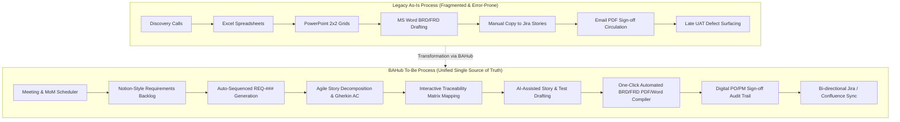
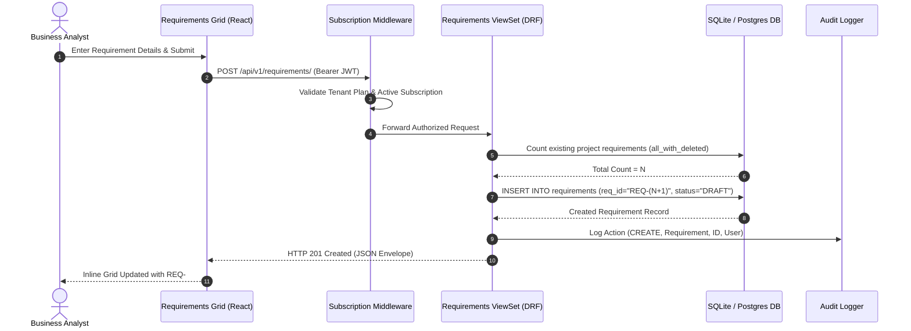

# BAHub — Business Process Analysis & Workflow Engineering
**Document ID:** PROC-BAHUB-001  
**Project:** BAHub (The AI-Powered Business Analyst Workspace)  
**Author:** Senior Business Analyst / Process Engineering Lead  
**Classification:** Enterprise Process Architecture  
**Status:** Approved Baseline  

---

## 1. Executive Summary

This document reverse-engineers the end-to-end business and technical processes within **BAHub**. Grounded in repository source code (`backend/` and `frontend/src/`), this analysis details:
1.  **As-Is Process:** The fragmented, manual, legacy way business analysis is conducted without BAHub.
2.  **To-Be Process:** The unified, automated, multi-tenant workflow engineered within BAHub.
3.  **Detailed Implemented Processes:** Exact step-by-step specifications for core platform workflows.
4.  **Gap Analysis & Continuous Process Improvement:** Structural delta between current implementation and enterprise best practices.

*Classification Note (Adhering to Absolute Rules):*
*   `[ACTUAL IMPLEMENTED PROCESS]`: Reverse-engineered directly from models, views, and frontend components.
*   `[INFERRED PROCESS]`: Logically derived from user roles and data models where UI interactions imply operational hand-offs.
*   `[PROPOSED PROCESS]`: Recommended target-state improvements to address identified architectural gaps.

---

## 2. Macro Process Comparison (As-Is vs. To-Be)

---

## 3. Core Implemented Business Workflows

### Workflow 1: Requirements Elicitation & Backlog Management `[ACTUAL IMPLEMENTED PROCESS]`
*   **Purpose:** Capture, categorize, and prioritize business specifications with guaranteed sequential numbering and multi-tenant isolation.
*   **Trigger:** BA receives business specifications during stakeholder discovery workshops.
*   **Primary Actor:** Business Analyst (`role="BUSINESS_ANALYST"`).
*   **Inputs:** Project ID, Title, Description, Type (`FUNCTIONAL`, `NON_FUNCTIONAL`, `TECHNICAL`, `UI`), Priority (`HIGH`, `MEDIUM`, `LOW`), Source Stakeholder ID.
*   **Process Steps:**
    1.  User navigates to `/requirements` and selects an active project from the project context dropdown.
    2.  User clicks "+ Add Requirement" or edits inline in the Notion-style split grid.
    3.  Frontend dispatches `POST /api/v1/requirements/` with payload.
    4.  Backend queries existing requirements in project (including soft-deleted) to determine next sequence index (`REQ-###`).
    5.  Requirement is saved with default status `DRAFT` and version `1.0`.
    6.  Audit log record is automatically generated capturing action `CREATE` and user metadata.
*   **Decision Points:**
    *   *Is the title and project present?* If no, return HTTP 400 validation error.
    *   *Does the user's organization own the project?* If no, return HTTP 403 Forbidden.
*   **Business Rules:**
    *   `BRULE-REQ-001`: Requirement IDs must be unique within a project and format must match `REQ-###`.
    *   `BRULE-REQ-002`: Requirement cannot reference a stakeholder belonging to a different organization.
*   **Outputs:** Created `Requirement` instance, auto-generated `req_id`, updated backlog UI.
*   **Exceptions:**
    *   Tenant subscription expired or seat limit exceeded: Middleware returns HTTP 402/503.
    *   Duplicate sequence race condition: Handled via atomic database transactions.

---

### Workflow 2: Agile Story Decomposition & Jira Synchronization `[ACTUAL IMPLEMENTED PROCESS]`
*   **Purpose:** Decompose high-level functional requirements into developer-ready user stories with Gherkin acceptance criteria and synchronize them with external Jira boards.
*   **Trigger:** Requirement status transitions to `APPROVED`, initiating sprint planning.
*   **Primary Actors:** Product Owner (`role="PRODUCT_OWNER"`), Business Analyst.
*   **Inputs:** Requirement ID, Story Title, Role (*As a...*), Action (*I want to...*), Benefit (*So that...*), Acceptance Criteria (*Given/When/Then*), Story Points (1, 2, 3, 5, 8, 13).
*   **Process Steps:**
    1.  User opens User Stories board (`/stories`) or selects "Generate Stories" in AI Workspace.
    2.  User links story to parent requirement (`requirement_id`).
    3.  Backend automatically computes sequential Story ID (`US-###`) scoped to the parent requirement's project.
    4.  PO updates status across Kanban lanes: `TODO` -> `IN_PROGRESS` -> `QA` -> `DONE`.
    5.  User clicks "Sync to Jira" on story card.
    6.  Backend retrieves project's encrypted Jira API credentials from `IntegrationConfig` via Fernet decryption.
    7.  Backend submits REST call to Jira Cloud API to create issue type `Story`.
    8.  Jira issue key (e.g., `PROJ-102`) and direct URL are saved on the `UserStory` model (`jira_key`, `jira_url`).
*   **Business Rules:**
    *   `BRULE-STRY-001`: Every User Story must link to a valid parent Requirement; orphaned stories are rejected.
    *   `BRULE-STRY-002`: Jira synchronization requires active Enterprise subscription plan (`IsEnterprise`).
*   **Outputs:** Created `UserStory` record, Kanban card update, synchronized Jira ticket.

---

### Workflow 3: Automated BRD/FRD Document Compilation & Sign-off `[ACTUAL IMPLEMENTED PROCESS]`
*   **Purpose:** Automatically assemble structured database entities (stakeholders, requirements, user stories, risks, SWOT) into an executive-ready BRD/FRD specification and record digital sign-off.
*   **Trigger:** Product milestone reached or client requests formal specification package.
*   **Primary Actors:** Business Analyst (Author), Product Owner / Client Sponsor (Signatory).
*   **Inputs:** Project ID, Document Type (`BRD`, `FRD`, `IEEE`), Document Title, Version.
*   **Process Steps:**
    1.  User navigates to `/brd` or `/frd` and selects "Generate Document".
    2.  Compilation engine executes optimized SQL queries (`select_related`) to gather active requirements, stories, stakeholders, and risks.
    3.  Backend Markdown Assembler compiles the structured sections into a unified markdown document.
    4.  Record is saved in `BusinessDocument` with status `DRAFT`.
    5.  User reviews and edits document content in the rich document editor.
    6.  BA transitions document status to `REVIEW` and assigns to Product Owner for approval.
    7.  PO reviews and clicks "Sign Off Document".
    8.  Backend records `signed_off_by=request.user`, `signed_off_at=timezone.now()`, and updates status to `SIGNED_OFF`.
    9.  User exports print-ready Word (.docx) or A4 PDF via `WeasyPrint`/`python-docx`.
*   **Decision Points:**
    *   *Is the user an Admin or Product Owner?* Only authorized roles can execute formal sign-off.
    *   *Are there unapproved requirements included?* Warning banner displayed to reviewer.
*   **Business Rules:**
    *   `BRULE-DOC-001`: Once a document achieves `SIGNED_OFF` status, its text content is immutable; subsequent changes require a new document version (`version="2.0"`).
*   **Outputs:** Print-ready Word/PDF document, immutable sign-off audit log.

---

### Workflow 4: End-to-End User Acceptance Testing (UAT) & Defect Governance `[ACTUAL IMPLEMENTED PROCESS]`
*   **Purpose:** Validate that implemented features satisfy business specifications and track defects discovered during stakeholder acceptance.
*   **Trigger:** Engineering sprint completes; stories enter `QA` or `DONE`.
*   **Primary Actors:** QA Tester (`role="QA_TESTER"`), Business Stakeholder.
*   **Inputs:** Requirement ID, Test Title, Scenario, Acceptance Criteria, Execution Status (`PENDING`, `PASSED`, `FAILED`).
*   **Process Steps:**
    1.  QA navigates to `/uat` and drafts test cases linked to requirements.
    2.  Stakeholder or QA executes test scenario in target staging environment.
    3.  User marks test status: `PASSED` or `FAILED`.
    4.  If `FAILED`, user clicks "Log Defect" directly from the test case card.
    5.  User inputs defect title, description, and severity (`LOW`, `MEDIUM`, `HIGH`, `CRITICAL`).
    6.  System binds `Defect` to originating `TestCase` and parent `Requirement`.
    7.  Traceability Matrix (`/traceability`) dynamically highlights the broken requirement node in red.
*   **Business Rules:**
    *   `BRULE-UAT-001`: A test case cannot be marked `PASSED` while an active open `CRITICAL` or `HIGH` defect is attached.

---

## 4. Gap Analysis (As-Is vs. To-Be)

| Workflow Dimension | Legacy As-Is Baseline | BAHub Implemented To-Be | Gap Remaining (Improvement Opportunity) |
| :--- | :--- | :--- | :--- |
| **Requirements Management** | Local Excel spreadsheets; duplicate REQ IDs; file silos. | Notion-style web grid; auto-sequenced `REQ-###`; tenant isolation. | Automated CSV/Excel batch import wizard for legacy migrations. |
| **Traceability** | None; manual cross-referencing in Word tables. | Dynamic multi-entity table linking Requirements, Stories, Risks, Tests. | Visual interactive node-link graph export (SVG/PNG). |
| **User Story Authoring** | Manual drafting in Jira or text editors. | Parent-linked stories; Gherkin templates; AI story draft assistant. | Automated story point estimation suggestions based on word complexity. |
| **Specification Assembly** | 10–15 hours manual copy-pasting into Word. | Sub-15-second compilation from live database into Word/PDF. | Custom enterprise branding templates (client corporate headers). |
| **Jira Integration** | Manual re-typing of stories into Jira. | One-click REST API sync storing Jira issue keys and direct links. | Webhook listener to update BAHub story status when Jira ticket moves. |
| **Change Control** | Ad-hoc email threads and unrecorded verbal requests. | Formal `ChangeRequest` database records with impact assessments. | Automated email notification dispatch to signatories upon CR creation. |

---

## 5. Process Improvement Opportunities & Proposed Future State

1.  **Bi-directional Jira Webhook Ingestion `[PROPOSED PROCESS]`:**
    *   *Opportunity:* Currently, BAHub pushes stories to Jira. Implementing an inbound webhook listener (`/api/v1/integrations/jira/webhook/`) would automatically transition BAHub user stories to `DONE` when developers close Jira tickets.
2.  **Streaming AI Generation `[PROPOSED PROCESS]`:**
    *   *Opportunity:* Replace 2-second polling of `WorkflowExecution` with Server-Sent Events (SSE) or WebSockets to stream AI story generation tokens in real-time.
3.  **Collaborative Real-Time Editing with Operational Transformation `[PROPOSED PROCESS]`:**
    *   *Opportunity:* Upgrade pessimistic diagram locking to CRDT-based multi-cursor collaborative editing using Redis Channel Layers.
