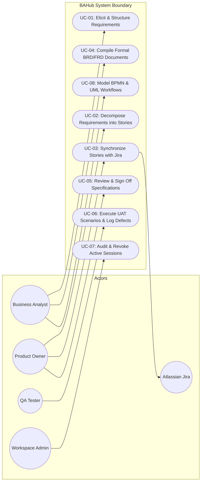

# Enterprise Use Case Specifications
## BAHub — System Capability Models & Detailed Interaction Specifications
**Document Reference:** UC-SPEC-BAHUB-2026-V1.0  
**Project:** BAHub (The AI-Powered Business Analyst Workspace)  
**Standard Adhered To:** Cockburn Use Case Model / UML 2.5  
**Author:** Senior Solutions Analyst / Business Architecture Specialist  
**Status:** Approved Specification  

---

## 1. System Use Case Diagram

---

## 2. Granular Use Case Specifications

### Use Case UC-01: Elicit & Structure Requirements
*   **Use Case ID:** `UC-01`
*   **Use Case Name:** Elicit, Categorize, and Sequence Requirements in Backlog Grid
*   **Primary Actor:** Business Analyst
*   **Secondary Actors:** Product Owner, Project Member
*   **Goal:** Successfully capture a new business specification, automatically assign a unique sequential ID (`REQ-###`), and categorize its operational attributes.
*   **Preconditions:**
    1.  User has an active session and belongs to the project's organization.
    2.  An active Project has been selected in workspace context.
*   **Trigger:** Business Analyst navigates to `/requirements` and clicks "+ New Requirement" or modifies an inline table row.
*   **Main Success Flow:**
    1.  The Business Analyst provides Title, Description, Type (`FUNCTIONAL`, `NON_FUNCTIONAL`, `TECHNICAL`, `UI`), Priority (`HIGH`, `MEDIUM`, `LOW`), and optional Source Stakeholder.
    2.  The analyst clicks "Save Requirement" or presses Enter in the inline editor.
    3.  System verifies that Title is non-empty and Project ID exists.
    4.  System locks the project transaction row and counts all historical requirements (including soft-deleted records).
    5.  System computes next sequence key (e.g. `REQ-015`).
    6.  System writes record to database with status `DRAFT` and version `1.0`.
    7.  System creates an entry in `audit_logs` table capturing action `CREATE`.
    8.  System returns HTTP 201 Created and updates the grid view.
*   **Alternative Flows:**
    *   *A1 (Inline Cell Edit):* The BA clicks directly on a cell (e.g., Status: `DRAFT` -> `REVIEW`). The system debounces, executes `PATCH /api/v1/requirements/{id}/`, records old and new values in the audit log, and flashes a green save indicator.
*   **Exception Flows:**
    *   *E1 (Cross-Tenant Link):* The BA selects a stakeholder belonging to another organization. The system halts save and displays: *"Error: Selected stakeholder does not exist within the current organization."*
    *   *E2 (Duplicate Submission):* Double-click on submit button handled by frontend button disabling state to prevent concurrent submissions.
*   **Postconditions:**
    1.  A new `Requirement` record is persisted in the database.
    2.  The requirement is immediately available for user story decomposition and traceability matrix inclusion.
*   **Business Rules:**
    *   `BRULE-REQ-001`: Requirement IDs must follow `REQ-###` and be unique per project.
*   **Dependencies:** `backend/requirements/models.py:Requirement`.

---

### Use Case UC-02: Decompose Requirements into User Stories
*   **Use Case ID:** `UC-02`
*   **Use Case Name:** Decompose Requirement into Agile User Story with Gherkin AC
*   **Primary Actor:** Product Owner
*   **Secondary Actor:** Business Analyst
*   **Goal:** Break down a high-level requirement into a developer-ready user story with Fibonacci points and Gherkin acceptance criteria.
*   **Preconditions:** Parent requirement exists in the project and is in `REVIEW` or `APPROVED` status.
*   **Trigger:** Product Owner opens the Story Editor modal on `/stories` or clicks "Generate Stories" in the AI Workspace.
*   **Main Success Flow:**
    1.  The PO selects the parent requirement from a dropdown list.
    2.  The PO enters User Role (*As a...*), Action (*I want to...*), and Business Benefit (*So that...*).
    3.  The PO inputs Gherkin Acceptance Criteria (*Given/When/Then*).
    4.  The PO selects story points from the Fibonacci scale: `1, 2, 3, 5, 8, 13`.
    5.  The PO submits the form.
    6.  System counts existing stories in the project and assigns the next sequential key (`US-###`).
    7.  System saves the story in the `TODO` column of the Kanban board.
    8.  System returns HTTP 201 Created.
*   **Alternative Flows:**
    *   *A1 (AI Story Drafting):* The PO selects "Draft with AI" in the AI Workspace. The system compiles the parent requirement description, dispatches a prompt to the AI orchestrator, and pre-fills the story title, user story text, and Gherkin criteria for PO review and approval.
*   **Exception Flows:**
    *   *E1 (Invalid Story Points):* PO attempts to submit a custom point value (e.g. 4 points). Backend rejects with HTTP 400 Bad Request: *"Points must be one of [1, 2, 3, 5, 8, 13]"*.
*   **Postconditions:** User story appears on Kanban board, linked to parent requirement.
*   **Dependencies:** `backend/stories/models.py:UserStory`.

---

### Use Case UC-03: Synchronize User Stories with Jira
*   **Use Case ID:** `UC-03`
*   **Use Case Name:** Synchronize User Story with Atlassian Jira Cloud
*   **Primary Actor:** Product Owner
*   **Goal:** Push a validated user story to an external Jira Cloud project and capture the generated Jira key.
*   **Preconditions:**
    1.  Organization has an active `ENTERPRISE` plan.
    2.  Project `IntegrationConfig` contains valid, verified Jira URL, email, and API token.
*   **Trigger:** User clicks "Sync to Jira" on a user story card.
*   **Main Success Flow:**
    1.  User triggers sync action on story `US-005`.
    2.  System retrieves `IntegrationConfig` for the project.
    3.  System uses AES-128 Fernet key to decrypt the stored `jira_api_token`.
    4.  System constructs Atlassian Jira REST API payload:
        *   `project.key`: Extracted from stored configuration.
        *   `summary`: Story Title.
        *   `description`: Story format + Gherkin Acceptance Criteria.
        *   `issuetype.name`: "Story".
    5.  System sends HTTPS POST to `https://{jira_domain}/rest/api/3/issue`.
    6.  Jira returns HTTP 201 Created with JSON payload: `{"key": "LOYALTY-102", "self": "..."}`.
    7.  System updates `UserStory.jira_key="LOYALTY-102"` and stores direct browse URL.
    8.  System returns HTTP 200 OK to the client.
    9.  Frontend story card updates to render an active Jira badge linking to Jira ticket.
*   **Exception Flows:**
    *   *E1 (Subscription Tier Ineligible):* Non-Enterprise organization triggers sync. System blocks with HTTP 403 Forbidden: *"Jira integration requires an active Enterprise subscription."*
    *   *E2 (Jira API Unreachable):* Jira Cloud responds with HTTP 500 or times out. System catches timeout, preserves local story state, and alerts user: *"Jira Cloud API timeout. Stored locally; retry sync later."*
*   **Postconditions:** Story is synchronized to Jira; Jira key is permanently linked to the BAHub database record.
*   **Dependencies:** `backend/integrations/models.py:IntegrationConfig`.

---

### Use Case UC-04: Compile Formal BRD/FRD Documents
*   **Use Case ID:** `UC-04`
*   **Use Case Name:** Dynamically Compile Multi-Entity BRD/FRD Specifications
*   **Primary Actor:** Business Analyst
*   **Goal:** Generate a comprehensive, audit-ready specification document directly from database entities without manual table formatting.
*   **Preconditions:** Selected project contains at least one requirement and stakeholder.
*   **Trigger:** BA navigates to `/brd` or `/frd` and clicks "Compile Document".
*   **Main Success Flow:**
    1.  BA selects document type (`BRD`, `FRD`, `IEEE`), enters title, and specifies version `1.0`.
    2.  BA clicks "Execute Compilation".
    3.  Backend executes an optimized multi-table join (`select_related`) to retrieve project profile, stakeholders, requirements, user stories, risks, and SWOT entries.
    4.  Backend Markdown Assembler stitches sections into standardized layout:
        *   Section 1: Executive Summary & Project Background.
        *   Section 2: Stakeholder Directory & 2x2 Matrix.
        *   Section 3: Scope & Functional Backlog Table.
        *   Section 4: User Story Catalog & Acceptance Criteria.
        *   Section 5: Risk Register & Scope Change Controls.
    5.  Document record is saved in `business_documents` table with status `DRAFT`.
    6.  Document renders in `RichDocumentEditor` allowing the BA to review and make minor edits.
    7.  BA downloads compiled document as Word (.docx) or A4 PDF.
*   **Postconditions:** A complete, print-ready document is persisted and ready for review queue assignment.
*   **Dependencies:** `backend/documents/models.py:BusinessDocument`, `weasyprint`, `python-docx`.

---

### Use Case UC-05: Review & Sign Off Specifications
*   **Use Case ID:** `UC-05`
*   **Use Case Name:** Authorize and Lock Document via PO/PM Digital Sign-off
*   **Primary Actor:** Product Owner / Workspace Admin
*   **Goal:** Provide legal/governance authorization for a compiled specification, locking its contents and establishing a project baseline.
*   **Preconditions:** Document exists in status `REVIEW`.
*   **Trigger:** Product Owner opens the document review screen and clicks "Authorize & Sign Off".
*   **Main Success Flow:**
    1.  The PO inspects the compiled document sections and verified requirements.
    2.  The PO clicks the "Authorize & Sign Off" button.
    3.  System prompts with confirmation modal: *"Confirm formal baseline sign-off for version 1.0?"*
    4.  PO confirms.
    5.  Backend validates that `request.user.role in ['PRODUCT_OWNER', 'ADMIN']`.
    6.  Backend updates `BusinessDocument`:
        *   `status = "SIGNED_OFF"`
        *   `signed_off_by = request.user`
        *   `signed_off_at = timezone.now()`
    7.  Backend creates an immutable record in `DocumentApprovalHistory`.
    8.  System locks the document editor into read-only mode.
    9.  System returns HTTP 200 OK with signatory metadata.
*   **Exception Flows:**
    *   *E1 (Unauthorized Role):* A user with role `DEVELOPER` attempts sign-off. System blocks request with HTTP 403 Forbidden.
*   **Postconditions:** Document is permanently locked as an official baseline.
*   **Dependencies:** `backend/documents/models.py`.

---

### Use Case UC-06: Execute UAT Scenarios & Log Defects
*   **Use Case ID:** `UC-06`
*   **Use Case Name:** Execute UAT Test Scenario, Record Result & Link Defect
*   **Primary Actor:** QA Tester / Business Stakeholder
*   **Goal:** Validate a functional requirement through an execution run and capture defects upon test failure.
*   **Preconditions:** Test case exists and is linked to an active requirement.
*   **Trigger:** User tests feature in staging environment and logs result on `/uat`.
*   **Main Success Flow:**
    1.  QA opens test case "TC-002: Loyalty Points Checkout".
    2.  QA marks execution status as `PASSED`.
    3.  System updates `TestCase.status = "PASSED"`.
    4.  Traceability Matrix reflects verified requirement.
*   **Alternative Flow (Test Failure & Defect Logging):**
    1.  QA identifies an error and marks status as `FAILED`.
    2.  System automatically displays "Report Defect" dialog.
    3.  QA inputs defect title, steps to reproduce, and severity (`HIGH`).
    4.  System creates a `Defect` record linked via foreign key to `TestCase`.
    5.  System updates Traceability Matrix showing requirement row with a red defect indicator badge.
*   **Postconditions:** Test execution is recorded; defects are directly traceable to originating business requirements.
*   **Dependencies:** `backend/uat/models.py:TestCase`, `Defect`.
