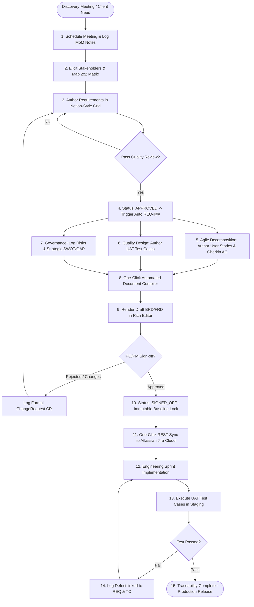
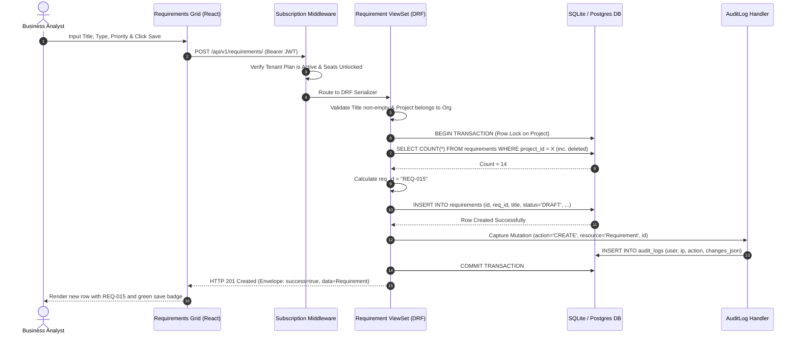
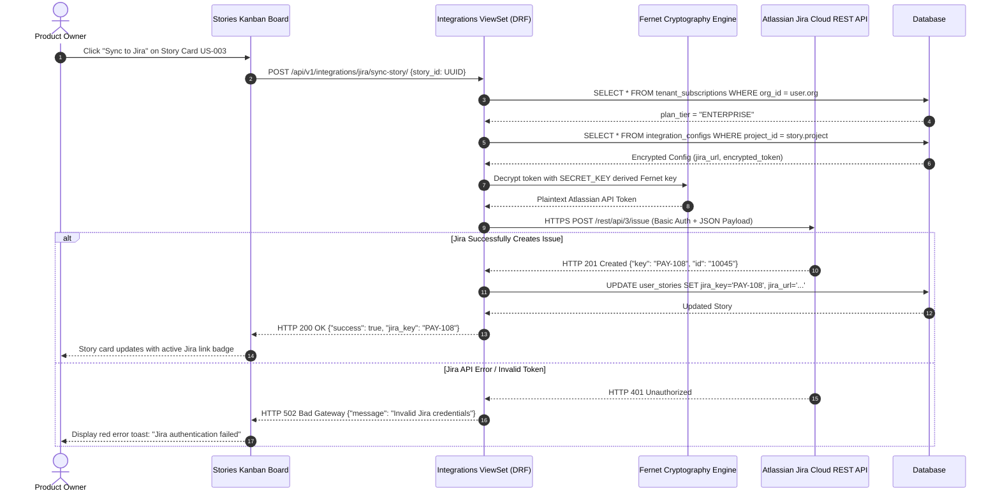
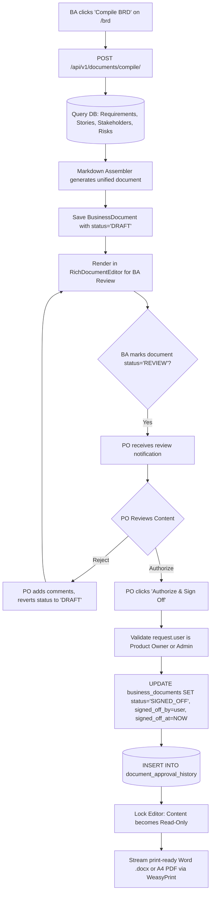
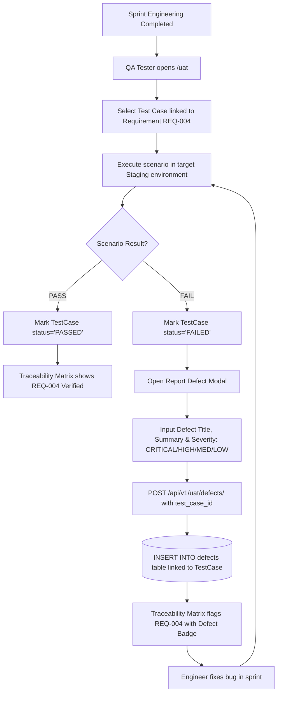

# Enterprise Business Process Flows & Activity Diagrams
## BAHub — Visual Process Architecture & Sequence Engineering
**Document Reference:** PF-SPEC-BAHUB-2026-V1.0  
**Project:** BAHub (The AI-Powered Business Analyst Workspace)  
**Standard Adhered To:** BPMN 2.0 / UML Activity & Sequence Diagrams  
**Author:** Lead Process Architect / Senior Solutions Analyst  
**Status:** Approved Architecture Baseline  

---

## 1. Master Requirements-to-Release Lifecycle (Macro Flow)

The following BPMN-style activity diagram illustrates how a business feature moves through the entire BAHub unified lifecycle from discovery meeting to verified production release:

---

## 2. Granular Process Flows & Sequence Logic

### Workflow PF-01: Auto-Sequenced Requirement Ingestion & Audit Logging

#### Detailed Process Specifications
*   **Process Name:** Sequential Requirement Creation & Audit Logging
*   **Purpose:** Enforce unique, human-readable requirement keys without numbering collisions during concurrent multi-user editing.
*   **Actors:** Business Analyst, System Middleware, Relational Database.
*   **Trigger:** User adds a requirement via the web interface or API.
*   **Decision Points:**
    *   *Decision 1:* Is the tenant organization's subscription active? If no, block request and return HTTP 402/503.
    *   *Decision 2:* Does the user belong to the organization owning the project? If no, return HTTP 403 Forbidden.
*   **Business Rules:**
    *   `BRULE-REQ-001`: Requirement IDs are permanent and immutable once generated.
    *   `BRULE-REQ-002`: Soft-deleted records are included in the sequence count to prevent collision if restored.

---

### Workflow PF-02: User Story Jira Synchronization with Encrypted Credentials

#### Detailed Process Specifications
*   **Process Name:** Encrypted Jira Cloud Story Synchronization
*   **Purpose:** Seamlessly transition business specifications into engineering execution boards without exposing plaintext API credentials.
*   **Actors:** Product Owner, Django Backend, Fernet Cryptography Engine, Atlassian Jira Cloud.
*   **Trigger:** PO clicks "Sync to Jira" on a valid user story card.
*   **Exceptions:**
    *   *Tier Ineligible:* Non-Enterprise tenants receive HTTP 403 with upgrade prompt.
    *   *Network Timeout:* If Jira API does not respond within 5000ms, the request times out safely without corrupting local story state.

---

### Workflow PF-03: Multi-Entity Document Compilation & Sign-off

#### Detailed Process Specifications
*   **Process Name:** Automated Document Compilation and Digital Sign-off
*   **Purpose:** Eliminate manual document formatting and establish a legally auditable specification baseline.
*   **Actors:** Business Analyst, Product Owner, Markdown Assembler Engine.
*   **Outputs:** Persisted `BusinessDocument` record, approval audit history, downloadable Word (.docx) and A4 PDF packages.
*   **Business Rules:**
    *   `BRULE-DOC-001`: Once set to `SIGNED_OFF`, document content is immutable. Any modifications require creating a new version (`version="2.0"`).

---

### Workflow PF-04: End-to-End UAT Execution & Defect Linkage

#### Detailed Process Specifications
*   **Process Name:** UAT Verification Run & Defect Linkage
*   **Purpose:** Ensure all business requirements are verified by testing before release, and provide immediate defect root-cause visibility.
*   **Actors:** QA Test Analyst, Software Engineer, Traceability Engine.
*   **Outputs:** Updated `TestCase` status, created `Defect` record, real-time update to Traceability Matrix.
