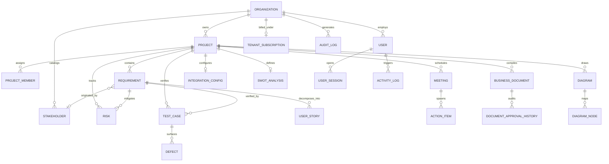

# Enterprise Data Architecture & Relational Entity Analysis
## BAHub — Business Data Modeling, Relationships & Schema Architecture
**Document Reference:** DA-SPEC-BAHUB-2026-V1.0  
**Project:** BAHub (The AI-Powered Business Analyst Workspace)  
**Standard Adhered To:** Relational Database Architecture / ER Modeling / Data Governance  
**Author:** Senior Solutions Architect / Technical Data Business Analyst  
**Status:** Approved Schema Baseline  

---

## 1. Executive Summary & Data Governance Principles

The data architecture of BAHub is engineered around three foundational enterprise principles:
1.  **Strict Multi-Tenant Scoping:** All core data entities belong to an `Organization` container. Cross-tenant queries are prevented by schema-level foreign keys and DRF query filters.
2.  **Auditability & Soft Deletion:** Root models inherit from `core.models.BaseModel`, providing immutable UUIDv4 primary keys, automatic `created_at`/`updated_at` audit timestamps, and soft deletion (`is_deleted=True`) to guarantee zero physical data loss.
3.  **Referential Integrity & Sequential Traceability:** Database transactions enforce parent-child foreign key bindings (Requirements -> Stories -> Tests -> Defects), and row-level locks prevent identifier collisions.

---

## 2. Entity-Relationship Diagram (ERD)

---

## 3. Core Business Data Entities Analysis

### 3.1 Entity: `Organization`
*   **Business Meaning:** The top-level tenant container representing a customer enterprise, IT agency, or corporate department.
*   **Operational Purpose:** Acts as the security boundary for multi-tenancy. All users, projects, and billing subscriptions roll up to this container.
*   **Important Fields:** `id` (UUIDv4), `name` (VARCHAR 255), `timezone` (VARCHAR), `email` (VARCHAR), `is_deleted` (BOOLEAN).
*   **Relationships:**
    *   One-to-Many with `User`
    *   One-to-Many with `Project`
    *   One-to-One with `TenantSubscription`
*   **Data Owner:** Workspace Administrator / Executive Client.
*   **Usage:** Filters all database queries across the API layer.

### 3.2 Entity: `Project`
*   **Business Meaning:** A dedicated workspace container for a specific client engagement, product release, or digital transformation initiative.
*   **Operational Purpose:** Scopes requirements, agile backlogs, risk registers, diagrams, and document compilations.
*   **Important Fields:** `id` (UUIDv4), `name` (VARCHAR 255), `status` (`ACTIVE`, `COMPLETED`, `ARCHIVED`), `start_date`, `end_date`.
*   **Relationships:**
    *   Many-to-One with `Organization` (`on_delete=CASCADE`)
    *   One-to-Many with `Requirement`, `Stakeholder`, `BusinessDocument`, `TestCase`
*   **Data Owner:** Lead Business Analyst / Project Manager.

### 3.3 Entity: `Requirement`
*   **Business Meaning:** An atomic specification of a functional capability, technical constraint, non-functional performance target, or UI behavior.
*   **Operational Purpose:** Serves as the central anchor of the entire platform. Drives user story decomposition, test case coverage, and document generation.
*   **Important Fields:**
    *   `req_id` (VARCHAR 50): Sequential human-readable key (e.g. `REQ-001`), unique per project.
    *   `title` (VARCHAR 255): Concise requirement name.
    *   `description` (TEXT): Full detailed specification text.
    *   `req_type` (`FUNCTIONAL`, `NON_FUNCTIONAL`, `TECHNICAL`, `UI`).
    *   `status` (`DRAFT`, `REVIEW`, `APPROVED`, `REJECTED`).
    *   `priority` (`HIGH`, `MEDIUM`, `LOW`).
    *   `version` (VARCHAR 20): Semantic version (e.g. `1.0`).
*   **Relationships:**
    *   Many-to-One with `Project`
    *   Many-to-One with `Stakeholder` (`source_stakeholder`)
    *   One-to-Many with `UserStory` (`user_stories`)
    *   One-to-Many with `TestCase` (`test_cases`)
*   **Data Owner:** Business Analyst.

### 3.4 Entity: `UserStory`
*   **Business Meaning:** An agile development ticket decomposing a business requirement into developer-executable increments.
*   **Operational Purpose:** Governs sprint backlogs, tracks Fibonacci velocity, and synchronizes directly with Atlassian Jira Cloud tickets.
*   **Important Fields:**
    *   `story_id` (VARCHAR 50): Sequential key (e.g. `US-001`), unique per parent project.
    *   `role`, `action`, `benefit` (TEXT): Standard agile format (*As a... I want to... So that...*).
    *   `acceptance_criteria` (TEXT): Executable Gherkin syntax (*Given/When/Then*).
    *   `points` (INT): Fibonacci scale (`1, 2, 3, 5, 8, 13`).
    *   `status` (`TODO`, `IN_PROGRESS`, `QA`, `DONE`).
    *   `jira_key` (VARCHAR 100): External issue key (e.g. `PROJ-102`).
    *   `jira_url` (URL): Direct link to Atlassian Jira Cloud.
*   **Relationships:**
    *   Many-to-One with `Requirement` (`on_delete=CASCADE`)
*   **Data Owner:** Product Owner / Scrum Master.

### 3.5 Entity: `BusinessDocument`
*   **Business Meaning:** A compiled specification artifact (BRD, FRD, IEEE 830, SWOT, GAP) representing a frozen or reviewed project deliverable.
*   **Operational Purpose:** Assembles database entities into printable Word (.docx) and A4 PDF packages; maintains formal PO/PM digital sign-off records.
*   **Important Fields:**
    *   `doc_type` (`BRD`, `FRD`, `SWOT`, `GAP`, `IEEE`).
    *   `title` (VARCHAR 255), `version` (VARCHAR 20).
    *   `status` (`DRAFT`, `REVIEW`, `APPROVED`, `SIGNED_OFF`).
    *   `content` (TEXT): Full compiled markdown specification text.
    *   `signed_off_by` (FK User), `signed_off_at` (DATETIME): Immutable digital sign-off record.
*   **Relationships:**
    *   Many-to-One with `Project`
    *   One-to-Many with `DocumentApprovalHistory`
*   **Data Owner:** Product Owner / Client Sponsor.

### 3.6 Entity: `TestCase` & `Defect`
*   **Business Meaning:** Test verification scenario confirming whether implemented software satisfies business criteria, and the defect logged when verification fails.
*   **Operational Purpose:** Closes the requirements loop; ensures 100% verification coverage before production release.
*   **Important Fields (TestCase):** `title`, `scenario`, `acceptance_criteria`, `status` (`PENDING`, `PASSED`, `FAILED`).
*   **Important Fields (Defect):** `title`, `description`, `severity` (`LOW`, `MEDIUM`, `HIGH`, `CRITICAL`), `status` (`OPEN`, `IN_PROGRESS`, `RESOLVED`, `CLOSED`).
*   **Relationships:**
    *   `TestCase` Many-to-One with `Requirement` and `Project`
    *   `Defect` Many-to-One with `TestCase` and `Requirement`
*   **Data Owner:** QA Test Analyst / UAT Lead.

### 3.7 Entity: `IntegrationConfig`
*   **Business Meaning:** Secure configuration vault storing third-party connector settings for Jira Cloud, Confluence, and Slack.
*   **Operational Purpose:** Authorizes API calls to external systems while protecting credentials at rest using cryptographic encryption.
*   **Important Fields:** `jira_url`, `jira_email`, `jira_api_token` (`EncryptedCharField` using AES-128 Fernet), `confluence_url`, `slack_webhook_url`.
*   **Relationships:** One-to-One with `Project`.
*   **Data Owner:** Workspace Administrator.

---

## 4. Master Data vs. Transaction Data Taxonomy

| Category | Entities | Mutation Frequency | Retention Policy | Primary Users |
| :--- | :--- | :--- | :--- | :--- |
| **Master Data** | `Organization`, `User`, `Project`, `Stakeholder`, `IntegrationConfig`, `TenantSubscription` | Low (Setup and configuration phase) | Permanent / Soft-Delete only | Administrators, Lead BAs |
| **Transaction Data** | `Requirement`, `UserStory`, `Meeting`, `ActionItem`, `Risk`, `ChangeRequest`, `TestCase`, `Defect`, `BusinessDocument` | High (Daily sprint operations) | Full Version History / Audit Log | Business Analysts, POs, Developers, QA |
| **Audit & Log Data** | `AuditLog`, `UserSession`, `ActivityLog`, `PaymentAuditLog` | Continuous (Every API mutation/login) | Immutable / Append-Only | Security Officers, Compliance Auditors |
