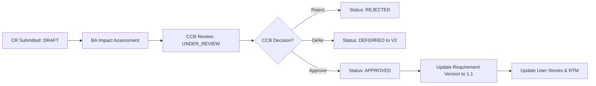

# Change Request (CR) Governance & Change Log
## BAHub — Scope Change Control & Impact Assessment Log
**Document Reference:** CR-LOG-BAHUB-2026-V1.0  
**Project:** BAHub (The AI-Powered Business Analyst Workspace)  
**Standard Adhered To:** BABOK v3 Requirements Change Management  
**Author:** Lead Business Analyst / Change Control Board (CCB) Facilitator  
**Status:** Operational Register  

---

## 1. Scope Change Management Framework

In BAHub, scope changes are never introduced via casual emails, undocumented chat requests, or ad-hoc developer commitments. All modifications to baselined requirements (`status="APPROVED"` or `"SIGNED_OFF"`) must pass through the formal **Change Control Board (CCB)** governance workflow supported by the `risks.models.ChangeRequest` entity.

### Change Request Lifecycle:

---

## 2. Change Request Register

*Notice: The following entries represent `[SIMULATED INTERVIEW SCENARIOS]` designed to demonstrate how a Senior Business Analyst assesses scope impact, calculates cost/schedule delta, and conducts CCB triage for BAHub.*

### Change Request CR-001: Bi-directional Jira Webhook Listener `[SIMULATED INTERVIEW SCENARIO]`
*   **CR ID:** `CR-001`
*   **Submission Date:** 2026-09-12
*   **Requester:** Engineering Lead (Alex Mercer)
*   **Title:** Inbound Jira Webhook for Automated Story Status Synchronization
*   **Description:** Currently, BAHub pushes user stories to Jira via REST API. When developers mark tickets `DONE` in Jira, the BAHub Kanban board does not update automatically. This CR requests an inbound webhook endpoint (`/api/v1/integrations/jira/webhook/`) to update story status in real-time.
*   **Business Justification:** Eliminates manual status re-checking by BAs; ensures BAHub dashboards reflect actual engineering sprint completion.
*   **Impact Assessment:**
    *   *Requirements Affected:* `INT-002`, `FR-002`.
    *   *Technical Complexity:* Medium (Requires webhook secret signature verification and background task handling).
    *   *Effort Estimate:* 3 Developer Days (18 Story Points).
    *   *Schedule Impact:* 0 days (Absorbed into Sprint 4 buffer).
    *   *Security Impact:* Low (Requires HMAC signature validation on incoming payloads).
*   **CCB Decision:** **APPROVED**
*   **Approver:** Sarah Jenkins (Product Owner)
*   **Implementation Status:** Scheduled for Sprint 4.

---

### Change Request CR-002: Export Document to Confluence Space `[SIMULATED INTERVIEW SCENARIO]`
*   **CR ID:** `CR-002`
*   **Submission Date:** 2026-09-18
*   **Requester:** Client Enterprise Sponsor (Apex Solutions Director)
*   **Title:** One-Click Publish Compiled BRD to Confluence Cloud Space
*   **Description:** Enterprise stakeholders prefer reviewing documentation directly within their corporate Confluence Cloud wiki spaces rather than downloading PDF attachments.
*   **Business Justification:** Enhances client executive adoption and aligns with corporate documentation guidelines.
*   **Impact Assessment:**
    *   *Requirements Affected:* `REP-001`, `INT-001`.
    *   *Technical Complexity:* Medium (Requires Confluence REST API v2 markdown-to-storage-format converter).
    *   *Effort Estimate:* 5 Developer Days.
    *   *Schedule Impact:* +2 days to release baseline if implemented immediately.
*   **CCB Decision:** **DEFERRED TO RELEASE 1.1**
*   **Approver:** Sarah Jenkins (Product Owner)
*   **Rationale for Deferral:** Release 1.0 scope is frozen; existing PDF and Word exports satisfy baseline contract requirements.

---

### Change Request CR-003: Expand Free Tier Seat Limit from 5 to 10 `[SIMULATED INTERVIEW SCENARIO]`
*   **CR ID:** `CR-003`
*   **Submission Date:** 2026-09-25
*   **Requester:** Growth Marketing Consultant
*   **Title:** Increase Free Tier Seat Allocation to Drive Viral Acquisition
*   **Description:** Request to modify `TenantSubscription.seats_limit` default from 5 to 10 users to enable larger teams to evaluate the platform without friction.
*   **Business Justification:** Increases top-of-funnel user sign-ups and viral invitations.
*   **Impact Assessment:**
    *   *Revenue Impact:* Negative (Reduces conversion incentive for 6-to-10-person agencies into Pro tier).
    *   *Infrastructure Impact:* Increases database row volume and WebSocket connection overhead by ~30%.
*   **CCB Decision:** **REJECTED**
*   **Approver:** Executive Product Steering Committee
*   **Rationale for Rejection:** Dilutes core monetization strategy; 5 seats is sufficient for evaluation while motivating small consulting teams to upgrade to Pro.
