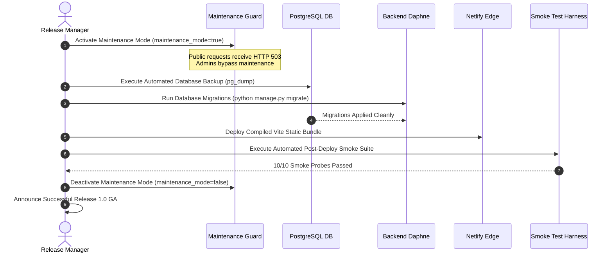

# Enterprise Release Plan — Release 1.0 (GA)
## BAHub — Production Cutover Strategy, Smoke Testing & Rollback Runbook
**Document Reference:** REL-PLAN-BAHUB-2026-V1.0  
**Project:** BAHub (The AI-Powered Business Analyst Workspace)  
**Author:** Lead Technical Business Analyst / Release Manager  
**Status:** Approved Operational Plan  

---

## 1. Release Schedule & Deployment Window

*   **Target Release Baseline:** Version 1.0 General Availability (GA)
*   **Deployment Window:** Saturday, 22:00 UTC – Sunday, 02:00 UTC (4-Hour Maintenance Window)
*   **Target Environments:**
    *   Backend: Render Daphne ASGI Server (Python 3.13 / PostgreSQL)
    *   Frontend: Netlify Production Edge (Vite / React 18)
    *   Database: Cloud PostgreSQL (`CONN_MAX_AGE=600`, SSL enabled)

---

## 2. Pre-Deployment Readiness Checklist (Go/No-Go Criteria)

| Verification Item | Verification Command / Check | Required Result | Status |
| :--- | :--- | :--- | :--- |
| **Backend Automated Tests** | `cd backend && python manage.py test` | 179+ Tests Passed (0 Errors, 0 Failures) | **READY** |
| **Frontend Production Build**| `cd frontend && npm run build` | Exits Code 0 with clean asset hashes | **READY** |
| **Environment Variable Check**| `python -c "import settings; settings.validate_environment()"` | All required vars present (`SECRET_KEY`, `DATABASE_URL`) | **READY** |
| **Security Headers Validation**| Verify `security_headers.py` active | HSTS, CSP, and X-Frame-Options enabled | **READY** |
| **UAT Sign-off Record** | Digital sign-off log in `DocumentApprovalHistory` | Formally authorized by Product Owner | **READY** |

---

## 3. Step-by-Step Production Cutover Runbook

---

## 4. Post-Deployment Smoke Testing Protocol

Immediately following deployment, the Release Manager executes these 5 critical smoke tests:
1.  **Health Check Probe:** `GET https://api.bahub.local/api/v1/health` -> HTTP 200 `{ "status": "healthy" }`.
2.  **Authentication & Session Log:** Log into staging with demo credentials; verify `UserSession` record created with IP and User-Agent.
3.  **Sequential Requirement Creation:** Create test requirement; verify auto-generated `req_id="REQ-###"` increments cleanly.
4.  **Automated BRD Compilation:** Compile BRD on test project; verify A4 PDF streams without formatting errors.
5.  **Jira Integration Ping:** Dispatch credential test to Jira Cloud; verify HTTP 200 connection response.

---

## 5. Rollback Runbook (Contingency Plan)

If any Critical defect or data corruption occurs during cutover, the rollback protocol executes within 30 minutes:
1.  **Trigger Decision:** Unresolved Critical defect within 60 minutes of maintenance kickoff triggers immediate rollback.
2.  **Step 1:** Revert Netlify deployment to previous stable commit hash via Netlify CLI (`netlify deploy --prod --dir=previous_dist`).
3.  **Step 2:** Roll back database schema using recorded reverse migrations: `python manage.py migrate <app_name> <previous_migration>`.
4.  **Step 3:** If database corruption occurred, restore PostgreSQL snapshot from `pg_dump` taken at Step 2 of cutover.
5.  **Step 4:** Re-run health check probes to confirm system stability on the previous baseline.
