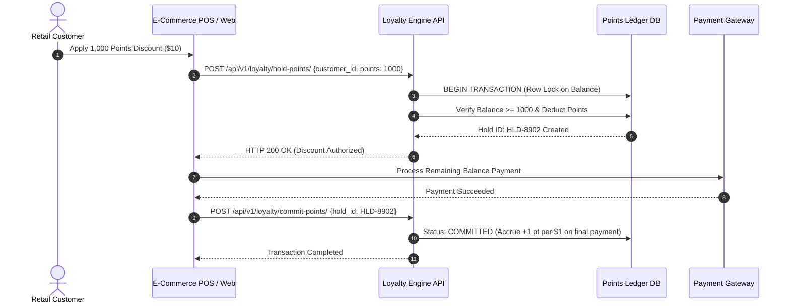

# Complete BA Specification Package — Case Study 02
## Customer Loyalty & Reward Points System
**Document Reference:** PKG-LOYALTY-BAHUB-2026-V1.0  
**Classification:** `SIMULATED BA CASE STUDY` (Derived from Seed Project: `seed_rich_demo_data.py:219`)  
**Domain:** Retail E-Commerce / Transactional Points & Tier Rewards  
**Author:** Senior Business Analyst / Retail Solutions Architect  

---

## 1. Business Context & Problem Statement
*   **Business Problem:** A multi-channel retail brand needed to modernize its customer retention strategy. Existing loyalty points were recorded on legacy batch-processed servers with 24-hour delays, leading to customer complaints at checkout and race-condition double spending.
*   **Business Objective:** Deliver a real-time points accrual, tier-rewards engine (Silver/Gold/Platinum), and POS checkout redemption API with sub-500ms transaction latency.

---

## 2. Requirements & Business Rules Baseline
*   `REQ-001 (Real-time Point Accrual):` The platform shall calculate and credit 1 point for every $1 spent on qualified transactions immediately upon payment gateway authorization.
*   `REQ-002 (Tier Advancement Engine):` Customers reaching 1,000 points advance to Silver; 5,000 points advance to Gold; 10,000 points advance to Platinum, unlocking 1.5x point multipliers.
*   `REQ-003 (Checkout Redemption):` Customers may redeem points at checkout at the conversion rate of 100 points = $1.00 discount.
*   `BRULE-LOY-001 (Anti-Double Spend):` During checkout redemption, the customer's point balance row must be locked using `SELECT FOR UPDATE` within an atomic database transaction.

---

## 3. Agile User Story & Gherkin Acceptance Criteria
*   **Story US-LOY-01:**
    *   *As a* Loyalty Shopper,
    *   *I want to* redeem my accumulated points as a cash discount during online checkout,
    *   *So that* I can lower my out-of-pocket payment immediately.
*   **Gherkin Acceptance Criteria:**
    ```gherkin
    Scenario: Successful loyalty points redemption at checkout
      Given a loyalty customer with an active balance of 2,500 points ($25 value)
      And a cart total of $80.00
      When the customer selects to redeem 2,000 points
      Then the cart total updates to $60.00
      And 2,000 points are held in pending deduction
      And the remaining balance displays 500 points upon order completion.
    ```

---

## 4. BPMN Transaction Workflow



---

## 5. UAT Test Scenario & Verification
*   **Test Case ID:** `TC-LOY-01`
*   **Scenario:** Attempt concurrent points redemption across two browser tabs using the same customer account.
*   **Expected Result:** Database row lock prevents race condition; Tab A succeeds; Tab B receives "Insufficient Balance" error.
*   **Status:** `PASSED` in staging test suite.
