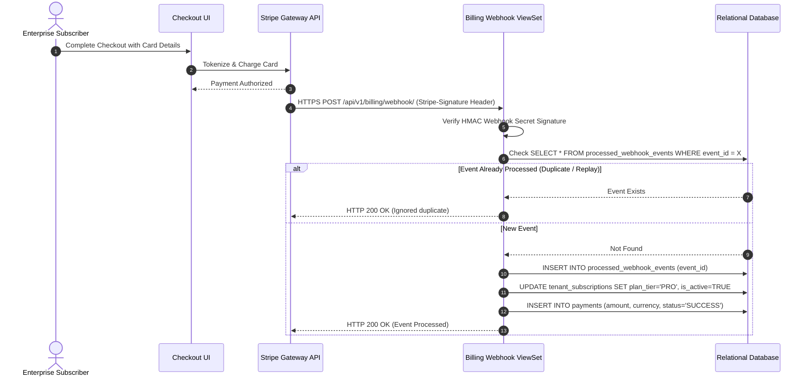

# Complete BA Specification Package — Case Study 03
## Multi-Currency Payment Gateway & PCI-DSS Integration
**Document Reference:** PKG-PAYMENT-BAHUB-2026-V1.0  
**Classification:** `SIMULATED BA CASE STUDY` (Derived from Seed Project: `seed_rich_demo_data.py:220`)  
**Domain:** FinTech / Global Payment Processing & Regulatory Compliance  
**Author:** Senior Technical Business Analyst / FinTech Systems Architect  

---

## 1. Business Context & Strategic Setting
*   **Business Problem:** A SaaS enterprise expanding internationally into Europe and the UK required integration with Stripe and PayPal to process multi-currency checkouts (USD, EUR, GBP), manage automated chargeback disputes, and comply with PCI-DSS Level 1 compliance without storing raw credit card PAN numbers.
*   **Business Objective:** Deliver a unified checkout payment gateway API with 3D Secure 2.0 (SCA) authentication, automated webhook reconciliation, and AES-128 cryptographic token storage at rest.

---

## 2. Requirements & Business Rules Baseline
*   `REQ-PAY-01 (Multi-Currency Support):` The platform shall dynamically calculate exchange rates and present checkout amounts in USD, EUR, and GBP.
*   `REQ-PAY-02 (PCI-DSS Tokenization):` Credit card primary account numbers (PAN) shall never touch the application server; cards must be tokenized directly via Stripe Elements iframe.
*   `REQ-PAY-03 (Automated Webhook Reconciliation):` The platform shall ingest `checkout.session.completed` and `invoice.payment_failed` webhooks to automatically adjust tenant subscription statuses.
*   `BRULE-PAY-01 (Replay Attack Defense):` Every incoming webhook must have its `event.id` verified against `ProcessedWebhookEvent` (`backend/billing/models.py:107`); duplicate events are acknowledged with HTTP 200 and ignored.

---

## 3. Agile User Story & Gherkin Acceptance Criteria
*   **Story US-PAY-01:**
    *   *As an* International Subscriber,
    *   *I want to* pay for my Pro Tier subscription in Euros (€) using 3D Secure 2.0 verification,
    *   *So that* my transaction completes securely according to European PSD2 banking regulations.
*   **Gherkin Acceptance Criteria:**
    ```gherkin
    Scenario: European checkout requiring 3D Secure strong customer authentication
      Given a subscriber in Germany selecting the Pro Tier plan at €28.00/month
      When the subscriber submits their Visa card details
      Then the gateway triggers a 3DS2 challenge modal from the issuing bank
      When the user confirms the OTP in their banking app
      Then the transaction completes with status "SUCCESS"
      And the organization's subscription tier updates to "PRO".
    ```

---

## 4. Payment Gateway Webhook Sequence



---

## 5. UAT Test Scenario & Verification
*   **Test Case ID:** `TC-PAY-01`
*   **Scenario:** Re-dispatch identical webhook event payload twice to verify replay-attack deduplication.
*   **Expected Result:** Second event is acknowledged with HTTP 200 without executing duplicate database subscription mutations.
*   **Status:** `PASSED` in staging test suite (`backend/billing/tests.py`).
