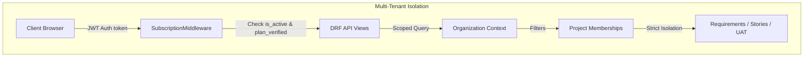
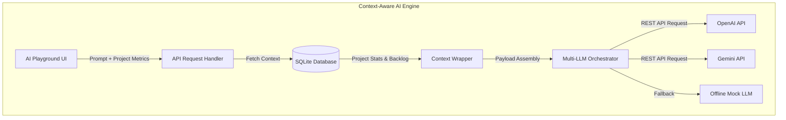
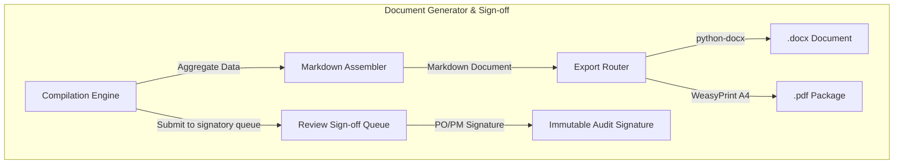

<div align="center">
  

  # BAHub

  ### The AI-Powered Business Analyst Workspace

  A production-ready, enterprise-grade workspace that eliminates manual business analysis overhead.  
  Synthesize requirements, generate user stories, design stakeholder maps, compile BRDs, and sync with Jira—all in a unified, multi-tenant collaboration platform.

  [Live Demo](http://localhost:5173) • [Documentation](#-navigation) • [Contributing](#-contribution-guide) • [License](#-license)

  <br />

  [](#)
  [](#)
  [](#)
  [](#)
</div>

---

## 📖 The Story

### The Problem
Modern product design and engineering teams move at terminal velocity, yet business analysis remains trapped in legacy paradigms:
- **Disjointed Artifacts**: Stakeholder spreadsheets, requirements docs, Kanban boards, and risks are scattered across multiple tools, breaking traceability.
- **Requirement-Story Drift**: Changes to a requirement fail to propagate down to user stories, leading to misaligned developer sprints.
- **Manual Compilations**: BAs waste countless hours compiling Business Requirements Documents (BRDs) and Functional Requirements Documents (FRDs) by copy-pasting tables.
- **Weak Billing & Access Limits**: Standard platforms lack tenant scoping, leading to data leaks, or fail to restrict resource usage based on tier quotas.

### Why BAHub Exists
BAHub was built to unify the entire business analysis lifecycle. It serves as a single source of truth connecting stakeholder expectations, functional backlogs, sprint pipelines, strategic SWOTs, risk registers, and UAT verification scenarios. By injecting a context-aware AI layer directly into the workspace, BAHub automates repetitive document compilation and user story creation, while keeping BAs in complete control.

---

## 🗺️ Navigation

- [📖 The Story](#the-problem)
- [✨ Features](#-features)
- [🖥️ Screenshot Walkthrough](#-screenshot-walkthrough)
- [🏗️ System Architecture](#-system-architecture)
- [🚀 Getting Started & Installation](#-getting-started--installation)
- [🛠️ Tech Stack](#%EF%B8%8F-tech-stack)
- [📂 Folder Structure](#-folder-structure)
- [🔑 Demo Access Profiles](#-demo-access-profiles)
- [🧪 Verification Commands](#-verification-commands)
- [⚡ Spotlight: Key Innovations](#-spotlight-key-innovations)
- [💎 Premium & Governance Details](#-premium--governance-details)

---

## ✨ Features

BAHub organizes business analysis activities into focused, high-performance modules:

| Core Workspace & Security | AI Capabilities |
| :--- | :--- |
| **Multi-Tenant Scoping**: Isolated workspaces with strict database cascade safeguards. Standard members are restricted to assigned projects; BAs, POs, and Admins scope all tenant data. | **Context-Aware Chat**: Prompt the assistant using live project statistics, stakeholder registers, and requirements. |
| **Profile & Preferences**: Theme states (Light/Dark/System), custom accent colors (Indigo/Green), and personalized date/time formats. | **AI Requirements Auditor**: Audit backlog compliance and identify engineering design gaps. |
| **Session Control**: Audit and revoke active sessions (IP, User Agent, device tracking). | **Sprint Automation**: Generate user stories and UAT scripts automatically. |
| **Workspace Teams**: Invite members, assign roles, and map teams to active project scopes. | **Multi-LLM Orchestrator**: Pluggable support for OpenAI and Gemini APIs, with local offline fallbacks. |

| Requirements & Agile | Documents & Governance |
| :--- | :--- |
| **Notion-Style Grid**: Inline backlog editor with categories (Functional, Non-Functional, Technical, Business, etc.) and status controls (Draft, Review, Approved, Implemented). | **BRD & FRD Compilers**: Dynamically bundle active requirements, user stories, and stakeholder matrices. |
| **Auto ID Triggers**: Database-level locks assign sequential codes (`REQ-001`) scoped per project to ensure unique keys. | **PO/PM Sign-off Queue**: Formal sign-off signatory logs for final product approvals. |
| **User Story Mapping**: Map user stories directly to parent functional requirements, using customizable Agile templates. | **Word & PDF Exports**: Export beautifully typeset documents (`.docx`, A4 `.pdf` packages) from the browser. |
| **Kanban Sprint Boards**: Drag-and-drop workflow lanes (*To Do*, *In Progress*, *Ready for QA*, *Done*) featuring Fibonacci story points. | **Risk Register & CR Control**: Submit scope changes and log probability-impact vectors for audit tracking. |

| Integrations & Enterprise | Strategic Planning & UAT |
| :--- | :--- |
| **Jira Sync Board**: Save credentials, test credentials, and push requirements directly to external boards. | **SWOT & Gap Analysis**: Planners charting Strengths, Weaknesses, Opportunities, and Threats alongside Current vs. Future state transitions. |
| **SOC 2 Audit Logging**: Immutable system event tracking for compliance and security audits. | **End-to-End Traceability**: Full traceability mapping requirements to risks, stories, meetings, and tests. |
| **Enterprise Billing Safeguards**: DRF-level subscription validation (`subscription.is_active` and `plan_verified`) with 3-day grace states. | **User Acceptance Testing (UAT)**: Scenario mapping, step-by-step steps, execution runs (Pass, Fail, Blocked), and client sign-off evidence. |
| **Mock Billing Parity**: Local billing simulation with PDF invoices and HTML receipts. Seat limits enforced (Free: 5, Pro: 20, Enterprise: Unlimited). | **Meeting MoM & Checklist**: Agenda, date, MoM notes, and checklist action items linked to users. |

---

## 🖥️ Screenshot Walkthrough

*Below are high-level design previews of BAHub's core product interfaces. Click each card to expand.*

<details>
<summary><b>📊 Dashboard & Project Directory</b></summary>

> [!NOTE]
> Displays active requirements, sprint completion rates, active team members, and overall project health indicators.
>
> 
</details>

<details>
<summary><b>📝 Requirements Backlog Grid</b></summary>

> [!NOTE]
> Interactive Notion-style spreadsheet for quick inline backlog edits, auto-incrementing custom keys, and stakeholder mapping.
>
> 
</details>

<details>
<summary><b>🔄 End-to-End Traceability Matrix</b></summary>

> [!NOTE]
> Maps upstream stakeholder needs and meetings down to functional requirements, user stories, risks, and UAT verify runs.
>
> 
</details>

<details>
<summary><b>📋 Kanban Board & User Story Editor</b></summary>

> [!NOTE]
> Agile sprint tracker featuring drag-and-drop lanes, custom formulation templates, and story point assignment.
>
> 
</details>

<details>
<summary><b>💼 Admin Panel & Billing Protection</b></summary>

> [!NOTE]
> Manage subscription plans, track historical payments, download PDF invoices, and monitor platform utilization.
>
> 
</details>

---

## 🏗️ System Architecture

### Multi-Tenant Isolation


### Context-Aware AI Engine


### Document Generator & Sign-off


---

## 🗺️ Project Journey: Evolution Roadmap

Below is the evolutionary roadmap charting BAHub's path from a clean boilerplate to a production-ready multi-tenant workspace:

```text
┌─────────────────────────────────────────────────────────────┐
│ 🏁 Phase 0: Conceptualization & Architecture Definition      │
│   • Designed custom nature-inspired executive color system   │
│   • Framed minimal layout patterns (Linear/Notion-inspired) │
└─────────────────────────────┬───────────────────────────────┘
                              │
                              ▼
┌─────────────────────────────────────────────────────────────┐
│ 📦 Phase 1: Setup, Boilerplate, and JWT Authentication     │
│   • Assembled Django REST Framework and customized responses│
│   • SimpleJWT integrations with UserSession database logger │
└─────────────────────────────┬───────────────────────────────┘
                              │
                              ▼
┌─────────────────────────────────────────────────────────────┐
│ 🏢 Phase 2: Multi-Tenancy & Project Scoping                 │
│   • Implemented Organization tenant scoping container       │
│   • Enforced cascading database deletion triggers           │
└─────────────────────────────┬───────────────────────────────┘
                              │
                              ▼
┌─────────────────────────────────────────────────────────────┐
│ 👥 Phase 3: Stakeholder Registers & Power/Interest Grid     │
│   • Profiled stakeholder registers (Title, contact, notes)  │
│   • Built interactive 2x2 grid sorting (Manage Closely, etc) │
└─────────────────────────────┬───────────────────────────────┘
                              │
                              ▼
┌─────────────────────────────────────────────────────────────┐
│ 📝 Phase 4: Structured Requirements Backlog Grid            │
│   • Auto-incrementing, project-scoped REQ codes (REQ-001)   │
│   • Notion-style grid editor supporting inline operations   │
└─────────────────────────────┬───────────────────────────────┘
                              │
                              ▼
┌─────────────────────────────────────────────────────────────┐
│ 🏃 Phase 5: Agile User Stories & Kanban Boards              │
│   • Story parent-child requirements mapping                 │
│   • Fibonacci estimation, drag-and-drop lane trackers       │
└─────────────────────────────┬───────────────────────────────┘
                              │
                              ▼
┌─────────────────────────────────────────────────────────────┐
│ 📄 Phase 6-7: Compiler Engine & Meeting Minutes MoM          │
│   • Structured markdown document compilers (BRD / FRD)      │
│   • MoM Minutes logger tracking user checkboxes status live │
└─────────────────────────────┬───────────────────────────────┘
                              │
                              ▼
┌─────────────────────────────────────────────────────────────┐
│ ⚠️ Phase 8-10: Governance, Strategy Canvases, Central Reports│
│   • Risk registry (Impact/Probability) and CR workflow     │
│   • SWOT, Gap analysis worksheets, and reporting dashboards │
└─────────────────────────────┬───────────────────────────────┘
                              │
                              ▼
┌─────────────────────────────────────────────────────────────┐
│ 🤖 Phase 11-13: AI Playground & Real-Time Sync              │
│   • Contextual chatbot supporting auto-story drafting       │
│   • WebSockets channels (Daphne) for active collaborator sync│
└─────────────────────────────┬───────────────────────────────┘
                              │
                              ▼
┌─────────────────────────────────────────────────────────────┐
│ 🖨️ Phase 14-16: Rich File Exports & Modern Design System    │
│   • Word and A4 PDF export engines (WeasyPrint)             │
│   • UI makeover: Plus Jakarta Sans fonts and styling overhaul│
└─────────────────────────────┬───────────────────────────────┘
                              │
                              ▼
┌─────────────────────────────────────────────────────────────┐
│ 🔒 Phase 17 (Present): Enterprise Billing & UAT Suites      │
│   • Multi-tenant billing verification backend middleware    │
│   • Traceability Matrix linking requirements backwards/forwards │
│   • End-to-end user acceptance testing scenario validator    │
│   • 100% verified test coverage (123/123 tests passing)     │
└─────────────────────────────────────────────────────────────┘
```

---

## 🛠️ Tech Stack

BAHub is built on a clean, decoupled architecture:

### Frontend
| Component | Technology | Description |
| :--- | :--- | :--- |
| **Core Framework** | React 18.2 + Vite | Strict TypeScript module system |
| **Routing** | React Router v6 | Declarative layout shell routing |
| **State & Data** | TanStack Query v4 | Automated data fetching and caching |
| **Forms** | React Hook Form + Zod | Schema-based form state validation |
| **Styling** | Tailwind CSS + Clsx | Fluid layout and responsive grids |
| **Icons** | Lucide React | Clean, scalable vector outline library |

### Backend
| Component | Technology | Description |
| :--- | :--- | :--- |
| **Core Engine** | Django 4.2+ (Python 3.13+) | Strong MVC/DRF patterns |
| **API Layer** | Django REST Framework | Clean JSON envelope wrapping |
| **Auth** | SimpleJWT | Stateless tokens, active session logger |
| **Database** | SQLite 3 | Unified local SQL development database |
| **Document Compilers** | python-docx / WeasyPrint | Native doc assembly and A4 PDF rendering |
| **AI Integration** | OpenAI & Gemini REST APIs | Custom pluggable LLM orchestrator |

---

## 📂 Folder Structure

```text
BAHub/
├── backend/                  # Django REST Framework backend
│   ├── core/                 # BaseModel, envelope responses, JWT logging
│   ├── users/                # Custom User, Session log, OTP validators
│   ├── organizations/        # Multi-tenant Organization container
│   ├── billing/              # Stripe checkout, invoice PDF, webhook, mock
│   ├── manage.py             # Django CLI entrypoint
│   └── requirements.txt      # Backend Python dependencies
├── frontend/                 # React + Vite + TS frontend
│   ├── src/
│   │   ├── app/              # Global state & context handlers
│   │   ├── components/       # Reusable UI kit & Stripe-inspired DataTable
│   │   ├── features/         # Feature screens (Dashboard, Profiles, Billing)
│   │   ├── services/         # Axios API clients with JWT refresh interceptors
│   │   ├── types/            # Global TypeScript interface declarations
│   │   └── index.css         # Accent variables, custom scrollbars, core CSS
│   └── package.json          # Frontend build manifest & scripts
├── run_all.bat               # Windows one-click developer runtime launcher
├── seed_data.bat             # Reset and populate local DB with seed data
└── LICENSE                   # MIT License
```

---

## 🚀 Getting Started & Installation

> [!NOTE]
> **Database Resolution Lock**: The SQLite database resolves permanently to [backend/db.sqlite3](file:///c:/Users/pinja/OneDrive/Desktop/BAHub/backend/db.sqlite3). Path resolutions in `settings.py` are locked to prevent duplicate databases.

### Setup Modes
*   **Windows One-Click Execution (Recommended)** — *Est. Setup: 1 Minute*
*   **Manual Setup** — *Est. Setup: 3 Minutes*

### Method 1: Windows One-Click
Double-click `run_all.bat` in the workspace root, or trigger it via PowerShell:
```powershell
.\run_all.bat
```
*To terminate both frontend and backend tasks, press `Ctrl+C` inside the active terminal window.*

To populate the database with a preconfigured sandbox environment containing requirements, stories, and stakeholders, run:
```powershell
.\seed_data.bat
```

### Method 2: Manual Setup

#### Step 1: Set up the Backend
1. Navigate into the backend root:
   ```bash
   cd backend
   ```
2. Activate the Python virtual environment:
   ```powershell
   .\venv\Scripts\activate
   ```
3. Run database migrations:
   ```bash
   python manage.py migrate
   ```
4. Launch the Daphne/Django service:
   ```bash
   python manage.py runserver
   ```
   *Backend listener resolves at `http://127.0.0.1:8000/`*

#### Step 2: Set up the Frontend
1. Open a new terminal and navigate to the frontend folder:
   ```bash
   cd frontend
   ```
2. Start the Vite bundler:
   ```bash
   npm run dev
   ```
   *Frontend application renders at `http://localhost:5173/`*

---

## 🔑 Demo Access Profiles

Pre-populated workspace demo credentials:
* **Business Analyst Account**:
  * **Username**: `analyst`
  * **Password**: `AnalystP@ss123`
* **Administrator Account**:
  * **Username**: `admin`
  * **Password**: `AdminP@ss123`
* **Django Admin Superuser**:
  * **Access Route**: `/admin` (navigating to `http://127.0.0.1:5173/admin` redirects to Django administration panel)
  * **Username**: `mustafa`
  * **Password**: `Mustafa@123`

---

## 🧪 Verification Commands

### Run Backend Tests
Tests verify the core base model, custom password validator constraints, registration, JWT logins, and session tracking:
```bash
cd backend
.\venv\Scripts\python manage.py test
```

### Run Frontend Build
Compiles all modules, style rules, and types into a production build:
```bash
cd frontend
npm run build
```

---

## ⚡ Spotlight: Key Innovations

### 🤖 1. AI Workspace Playground
*   **Purpose**: Automate the tedious, high-overhead phases of business analysis, such as user story generation and test script drafting.
*   **Workflow**: Select a requirements block, open the AI workspace, and choose an action (e.g. *Generate Stories*). The contextual handler compiles project metadata and submits it to the pluggable multi-vendor LLM API.
*   **Benefits**: Saves hours of writing manual stories; guarantees acceptance criteria formatting matches strict Gherkin patterns.
*   **Architecture**: Uses a centralized Django API view forwarding prompt-wrappers through a dedicated LLM runner interface to OpenAI or Gemini.

### 🔗 2. End-to-End Traceability Matrix
*   **Purpose**: Visualizes relationships between upstream stakeholder expectations, functional backlogs, risks, meetings, and verification runs to prevent scope creep.
*   **Workflow**: Displays a dynamic, cross-referenced table mapping each requirement backward to its source meeting and stakeholder, and forward to user stories, risks, and UAT execution logs.
*   **Benefits**: Confirms that every requirement has business justification and that every test case validates a real requirement.
*   **Architecture**: Performs a single, optimized SQL query utilizing pre-fetched select_related joins across multiple tables to prevent N+1 request lag.

### 💼 3. 2x2 Stakeholder Matrix Canvas
*   **Purpose**: Organizes stakeholder communication tactics and power-interest dynamics.
*   **Workflow**: Drop stakeholders on a visual grid categorizing them into four action zones (*Manage Closely*, *Keep Satisfied*, *Keep Informed*, *Monitor*). Updates sync instantly to the server.
*   **Benefits**: Visualizes target communication strategies for complex projects instantly.
*   **Architecture**: Fully reactive UI syncing positions to backend models on drag release.

### 📄 4. BRD & FRD Compilers
*   **Purpose**: Renders client-ready Business and Functional Requirement documents.
*   **Workflow**: Choose project, configure reviewer queues, compile text. Download print-ready documents in Word (`.docx`) or PDF formats.
*   **Benefits**: Instant compilation of 100-page specs directly from current database records.
*   **Architecture**: Merges aggregated markdown with custom templates using `python-docx` and `WeasyPrint` for A4 layout rendering.

### ⚡ 5. Real-time Collaboration (WebSockets)
*   **Purpose**: Synchronizes workspace data across active project collaborators.
*   **Workflow**: Shows active typing status indicator bubbles and real-time backlog updates.
*   **Benefits**: Eliminates data overwrites and coordinate conflicts when teams manage requirements concurrently.
*   **Architecture**: Uses ASGI WebSockets channels powered by Django Channels / Daphne.

### 🔒 6. Subscription & Billing Protection
*   **Purpose**: Safeguards premium features and restricts workspace sizes according to license tiers.
*   **Workflow**: A global backend middleware validates the active tenant organization's plan, billing status, and member limit on every restricted API call.
*   **Benefits**: Protects premium AI endpoints from unauthorized access while accommodating temporary payment issues using a 3-day grace period.
*   **Architecture**: Uses standard Django middleware that intercepts premium API routes and queries plan status directly from cache/database.

### 🧪 7. User Acceptance Testing (UAT)
*   **Purpose**: Coordinates stakeholder verification and documents release readiness.
*   **Workflow**: BAs write test cases linked directly to requirements; stakeholders execute the scenarios and record passes or fails with approval evidence signatures.
*   **Benefits**: Mitigates deployment risk by verifying every specification passes business review.
*   **Architecture**: Model layers track test results, execution runs, and sign-offs in atomic transaction scopes.

---

## 💎 Premium & Governance Details

### FAQ
<details>
<summary><b>Is local billing active in development?</b></summary>

> Yes. If you do not configure real Stripe API keys in your environment, the system automatically falls back to **Mock Billing**. In mock mode, completing checkout upgrade sends local verification emails and saves invoice drafts to disk without charging your card.
</details>

<details>
<summary><b>How are requirement IDs calculated?</b></summary>

> BAHub locks database transaction rows during requirement creation to dynamically build sequence indexes (`REQ-001`, `REQ-002`) isolated per project.
</details>

### Known Limitations
*   **Offline Mock AI**: In the absence of OpenAI/Gemini credentials, the orchestrator triggers a mock template generator to populate responses locally.
*   **WebSocket Scaling**: For high-volume deployment, configure a Redis backend channel layer (currently running local memory channels).

### Design Philosophy
Every view inside BAHub is designed from first principles. We prioritize typographic spacing, intentional element borders, unified interactive elements, and zero duplicate section layout structures—ensuring BAHub feels like a premium SaaS dashboard built for elite analysts.

### 🎨 Workspace Color System
BAHub uses a custom nature-inspired executive SaaS palette:
*   🟢 **Primary Accent**: `#467235` (Medium Forest Green) — Used for primary actions, active highlights, and buttons.
*   🟡 **Highlight Accent**: `#FFF78D` (Soft Cream Yellow) — Used for light background selection states, focus highlights, and active alerts.
*   🟨 **Warning State**: `#FFBF00` (Amber Yellow-Orange) — Used for alerts, warnings, and pending approval notifications.
*   🌲 **Dark Base**: `#283F24` (Deep Dark Forest Green) — Used as the base background, sidebar fills, and panels in Dark Mode.

### 🤝 Contribution Guide
We welcome contributors to BAHub! Follow these code standards:
*   **Python**: Enforce PEP 8 rules. All views must utilize the core API success/error envelopes.
*   **React**: Structure components as functional components in TypeScript strict mode. Limit inline style attributes; use Tailwind CSS utility tokens.

### 📄 License & Credits
BAHub is open-source software licensed under the [MIT License](LICENSE).  
Built with passion for Business Analysts and product teams.
