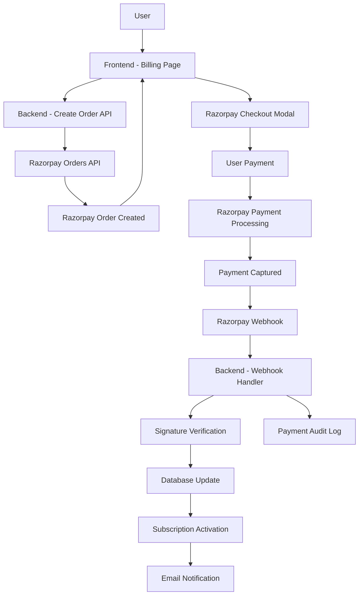
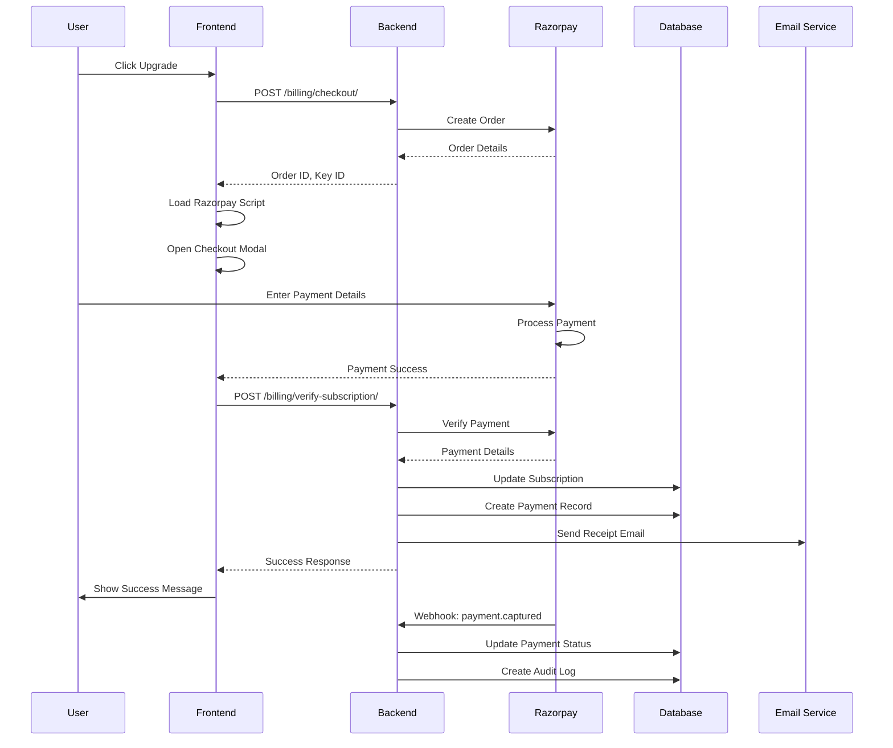
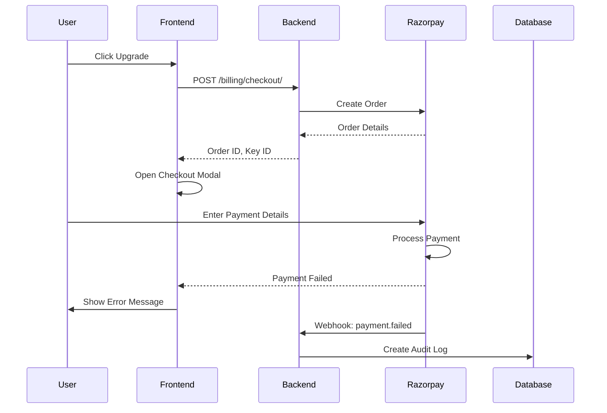

# BAHub Payment Architecture

This document explains the complete payment architecture for BAHub using Razorpay as the payment gateway.

## Architecture Overview



## Component Breakdown

### 1. Frontend Layer

#### Billing Page (`BillingPage.tsx`)

**Responsibilities:**
- Display current subscription status
- Show pricing plans
- Handle upgrade button clicks
- Load Razorpay checkout script
- Initialize Razorpay checkout
- Handle payment success/failure

**Key Functions:**
```typescript
loadRazorpayScript() - Dynamically loads Razorpay checkout JS
handleUpgrade(plan) - Initiates payment flow
verifyPayment() - Verifies payment signature
```

**Payment Flow:**
1. User clicks "Upgrade Workspace"
2. Frontend calls `/api/v1/billing/checkout/`
3. Backend creates Razorpay order
4. Frontend receives order details
5. Razorpay checkout modal opens
6. User completes payment
7. Razorpay calls handler with payment details
8. Frontend verifies payment with backend
9. Subscription is activated

### 2. Backend Layer

#### API Endpoints

**Create Order (`/api/v1/billing/checkout/`)**
- Method: POST
- Auth: Required (Admin only)
- Input: `{ plan: "PRO" | "ENTERPRISE" }`
- Output: `{ order_id, amount, currency, key_id, plan, frontend_origin }`

**Process:**
```python
1. Validate user is admin
2. Determine plan pricing
3. Create Razorpay order with notes (org_id, plan, user_email)
4. Return order details to frontend
```

**Verify Payment (`/api/v1/billing/verify-subscription/`)**
- Method: POST
- Auth: Optional (for webhook verification)
- Input: `{ razorpay_order_id, razorpay_payment_id, razorpay_signature, org_id, plan }`
- Output: Success/Failure response

**Process:**
```python
1. Verify payment signature
2. Fetch payment details from Razorpay
3. Validate payment status is 'captured'
4. Update subscription in database
5. Generate payment record
6. Send receipt email
```

**Webhook Handler (`/api/v1/billing/webhook/razorpay/`)**
- Method: POST
- Auth: None (signature verification)
- Input: Razorpay webhook payload
- Output: HTTP 200 OK

**Process:**
```python
1. Verify webhook signature
2. Parse webhook event type
3. Handle payment.captured events
4. Handle payment.failed events
5. Update database accordingly
6. Create audit logs
```

#### Database Models

**TenantSubscription**
```python
- organization: OneToOne
- gateway_customer_id: CharField (Razorpay customer ID)
- gateway_subscription_id: CharField (Razorpay order ID)
- plan_tier: CharField (FREE/PRO/ENTERPRISE)
- seats_limit: IntegerField
- ai_credits_limit: IntegerField
- is_active: BooleanField
- plan_verified: BooleanField
- expires_at: DateTimeField
- payment_status: CharField
```

**Payment**
```python
- receipt_number: CharField (unique)
- organization: ForeignKey
- subscription: ForeignKey
- gateway_payment_id: CharField (Razorpay payment ID)
- gateway_invoice_id: CharField (Razorpay invoice ID)
- gateway_order_id: CharField (Razorpay order ID)
- amount: DecimalField
- plan: CharField
- payment_method: CharField
- gateway: CharField (RAZORPAY)
- payment_status: CharField
- paid_at: DateTimeField
- invoice_pdf: FileField
```

**ProcessedWebhookEvent**
```python
- gateway_event_id: CharField (unique)
- processed_at: DateTimeField
```

**PaymentAuditLog**
```python
- organization: ForeignKey
- webhook_event: CharField
- old_plan: CharField
- new_plan: CharField
- gateway_response: TextField
- event_id: CharField
```

### 3. Razorpay Integration

#### Razorpay Orders API

**Order Creation:**
```python
order_data = {
    "amount": 4900,  # Amount in paise
    "currency": "INR",
    "receipt": "BAH-PRO-org123",
    "notes": {
        "organization_id": "org123",
        "plan": "PRO",
        "user_email": "user@example.com"
    }
}
razorpay_client.order.create(data=order_data)
```

**Order Fetch:**
```python
razorpay_client.order.fetch(order_id)
```

#### Razorpay Payments API

**Payment Fetch:**
```python
razorpay_client.payment.fetch(payment_id)
```

**Payment Capture:**
```python
# Automatic for card payments
# Manual for certain payment methods
razorpay_client.payment.capture(payment_id, amount)
```

#### Signature Verification

**Webhook Signature:**
```python
import hmac
import hashlib

def verify_webhook_signature(payload, signature, secret):
    generated_signature = hmac.new(
        secret.encode('utf-8'),
        payload,
        hashlib.sha256
    ).hexdigest()
    return hmac.compare_digest(generated_signature, signature)
```

**Client-Side Signature:**
```python
def verify_payment_signature(order_id, payment_id, signature, secret):
    generated_signature = hmac.new(
        secret.encode('utf-8'),
        f"{order_id}|{payment_id}".encode('utf-8'),
        hashlib.sha256
    ).hexdigest()
    return hmac.compare_digest(generated_signature, signature)
```

## Payment Flow Sequence

### Successful Payment Flow



### Failed Payment Flow



## Security Architecture

### 1. Signature Verification

**Webhook Security:**
- HMAC SHA256 signature verification
- Prevents fake webhook events
- Ensures payload integrity
- Timing-safe comparison

**Client-Side Security:**
- Payment signature verification
- Prevents payment tampering
- Server-side validation

### 2. Data Protection

**Sensitive Data:**
- API keys stored in environment variables
- Webhook secrets encrypted at rest
- Payment details never logged
- Card data handled by Razorpay only

**PCI Compliance:**
- No card data stored in database
- Razorpay handles PCI compliance
- Tokenized payment processing
- Secure checkout modal

### 3. Access Control

**API Authentication:**
- JWT required for checkout creation
- Admin-only access to billing operations
- Organization-level data scoping

**Webhook Access:**
- Signature-based authentication
- IP whitelist (Razorpay IPs)
- Rate limiting

## Error Handling

### 1. API Errors

**Order Creation Failed:**
```python
try:
    order = razorpay_client.order.create(data=order_data)
except Exception as e:
    logger.error(f"Order creation failed: {e}")
    return api_error("Failed to create payment order")
```

**Payment Verification Failed:**
```python
if not verify_signature(...):
    return api_error("Invalid payment signature", status=400)
```

### 2. Webhook Errors

**Signature Verification Failed:**
```python
if not verify_webhook_signature(...):
    logger.error("Webhook signature verification failed")
    return HttpResponse(status=400)
```

**Duplicate Event:**
```python
if ProcessedWebhookEvent.objects.filter(event_id=event_id).exists():
    return HttpResponse(status=200)  # Idempotent
```

### 3. Frontend Errors

**Checkout Failed:**
```typescript
rzp.on('payment.failed', (response) => {
  showError('Payment failed. Please try again.');
});
```

**Network Error:**
```typescript
try {
  const response = await api.post('/billing/checkout/', { plan });
} catch (error) {
  showError('Failed to initialize payment. Please try again.');
}
```

## Monitoring & Logging

### 1. Backend Logging

**Payment Events:**
```python
logger.info(f"Payment captured: {payment_id} for order {order_id}")
logger.error(f"Payment failed: {error_code} - {error_description}")
```

**Webhook Events:**
```python
logger.info(f"Webhook received: {event_type}")
logger.warning(f"Duplicate webhook event: {event_id}")
```

### 2. Audit Logging

**Payment Audit Log:**
```python
PaymentAuditLog.objects.create(
    organization=org,
    webhook_event=event_type,
    old_plan=old_plan,
    new_plan=new_plan,
    gateway_response=response,
    event_id=event_id
)
```

### 3. Metrics to Track

- Payment success rate
- Average payment processing time
- Webhook delivery rate
- Failed payment reasons
- Plan conversion rates
- Revenue per plan

## Scalability Considerations

### 1. Database Optimization

**Indexes:**
- `gateway_event_id` on ProcessedWebhookEvent
- `receipt_number` on Payment
- `organization_id` on TenantSubscription

**Query Optimization:**
- Use select_related for foreign keys
- Implement pagination for payment history
- Cache subscription status

### 2. Webhook Processing

**Async Processing:**
```python
# Consider using Celery for webhook processing
@shared_task
def process_webhook_async(webhook_data):
    # Process webhook asynchronously
    pass
```

**Queue Management:**
- Implement webhook queue
- Retry failed webhooks
- Monitor queue depth

### 3. Rate Limiting

**API Rate Limits:**
- Checkout creation: 10/minute per user
- Payment verification: 5/minute per user
- Webhook handling: 100/minute per IP

## Disaster Recovery

### 1. Backup Strategy

**Database Backups:**
- Daily automated backups
- Point-in-time recovery
- Payment records retention

**Configuration Backups:**
- Environment variables backup
- Webhook configuration backup
- API keys rotation schedule

### 2. Failover

**Webhook Redundancy:**
- Multiple webhook endpoints
- Load balancer configuration
- Automatic failover

**API Redundancy:**
- Multiple backend instances
- Database replication
- CDN for static assets

## Testing Strategy

### 1. Unit Tests

**Backend Tests:**
- Order creation logic
- Signature verification
- Database operations
- Email sending

**Frontend Tests:**
- Component rendering
- Payment flow
- Error handling
- Form validation

### 2. Integration Tests

**Payment Flow:**
- End-to-end payment test
- Webhook processing
- Database updates
- Email delivery

### 3. Load Tests

**Performance Testing:**
- Concurrent payment processing
- Webhook handling capacity
- Database query performance
- API response times

## Compliance & Legal

### 1. Data Privacy

**GDPR Compliance:**
- User consent for payment processing
- Data retention policies
- Right to deletion
- Data portability

### 2. Financial Compliance

**Tax Compliance:**
- GST calculation (for India)
- Invoice generation
- Tax reporting
- Audit trail

### 3. Refund Policy

**Refund Handling:**
- Refund request API
- Razorpay refund integration
- Refund audit logs
- Customer notification

## Future Enhancements

### 1. Subscription Management

**Auto-Renewal:**
- Razorpay subscription integration
- Automatic payment retry
- Dunning management
- Grace period handling

### 2. Multiple Payment Methods

**UPI Integration:**
- UPI QR code generation
- UPI app deep linking
- UPI status tracking

**NetBanking:**
- Bank selection
- OTP handling
- Status verification

### 3. Analytics Dashboard

**Payment Analytics:**
- Revenue trends
- Customer lifetime value
- Churn analysis
- Plan performance

## Summary

The BAHub payment architecture is designed to be:
- **Secure**: Signature verification, PCI compliance
- **Scalable**: Async processing, database optimization
- **Reliable**: Error handling, retry mechanisms
- **Maintainable**: Clean code, comprehensive logging
- **Compliant**: GDPR, tax regulations, audit trails

The integration with Razorpay provides a robust payment infrastructure while maintaining security and compliance standards.
