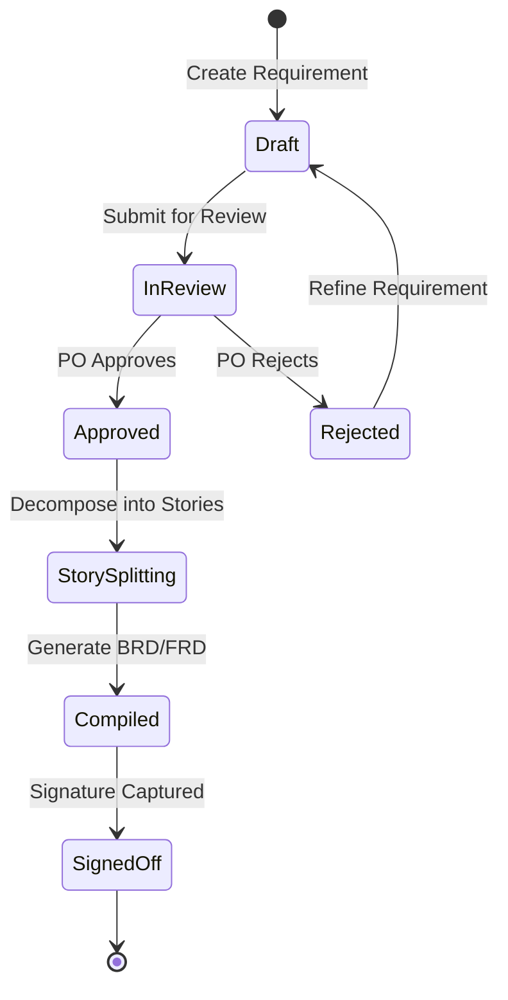
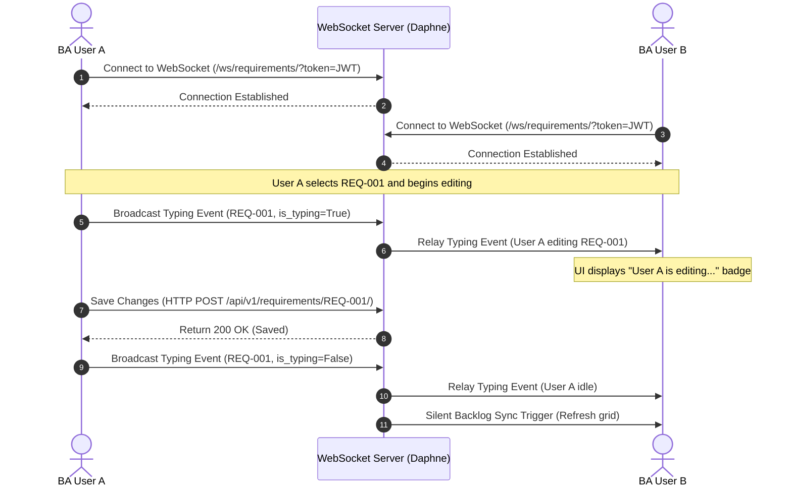

# BAHub - Phase 5: Process Modelling

This document details the functional process flows and system interactions within the **BAHub** workspace, modeled through Use Cases, Sequence diagrams, Activity diagrams, and Swimlane Workflows.

---

## 1. Use Case Specifications

### Use Case 1: Requirement Lifecycle Management
* **ID**: `UC-101`
* **Actor**: Business Analyst (BA)
* **Description**: The BA registers, organizes, and edits requirements within the Notion-style split grid interface.
* **Preconditions**: User is authenticated, has a `ProjectMember` role of Standard/Admin, and a project is selected.
* **Postconditions**: The requirement is persisted with a sequential ID (`REQ-###`) and is ready for decomposition into user stories.
* **Normal Flow of Events**:
  1. The BA navigates to the Requirements Split Grid page.
  2. The BA clicks the "+ Add Requirement" button.
  3. The BA fills in the Title, Description, Type, Priority, and Source Stakeholder fields.
  4. The BA clicks the "Save" button.
  5. The system validates the input, calculates the sequential ID (`REQ-###`), persists the record, and refreshes the left-hand grid view.
* **Alternate Flow (AF-01: Validation Error)**:
  * In Step 5, if required fields are missing, the system displays validation errors inline and keeps the form active.

### Use Case 2: Document Compile and Sign-Off Flow
* **ID**: `UC-102`
* **Actor**: Business Analyst (BA), Product Owner (PO)
* **Description**: The BA compiles the document and submits it to the PO. The PO reviews and signs off on the document.
* **Preconditions**: The project has at least one requirement.
* **Postconditions**: The BusinessDocument status transitions to `SIGNED_OFF`, archiving the baseline.
* **Normal Flow of Events**:
  1. The BA navigates to the Document Generator.
  2. The BA chooses document type (BRD or FRD) and triggers the compiler.
  3. The system pulls project data, formats it into Markdown, and saves the document in `DRAFT` status.
  4. The BA changes the status to `REVIEW`.
  5. The PO logs in, navigates to the compiled document view, and checks the details.
  6. The PO clicks the "Sign Off" button.
  7. The system updates the status to `SIGNED_OFF`, logging the signature metadata (`signed_off_by`, `signed_off_at`).
* **Alternate Flow (AF-02: Rejection)**:
  * In Step 6, if the PO requests changes, they click "Reject," shifting the document status back to `DRAFT` with comments.

---

## 2. Activity Diagram (Requirement Lifecycle Flow)

The diagram below maps the workflow of a requirement from initial discovery to design baseline.

---

## 3. Sequence Diagram (Real-Time Document co-authoring)

This diagram details the sequence of WebSocket message relays during a real-time collaborative editing session.

---

## 4. Swimlane Process Workflow

This swimlane diagrams responsibilities across roles and system boundaries during requirements management.

| Business Analyst (BA) | Product Owner (PO) | BAHub System | Jira Integration |
| :--- | :--- | :--- | :--- |
| **1. Gather requirements** | | | |
| **2. Log in split grid** | | | |
| | | **3. Auto-generate sequential ID** | |
| **4. Decompose to User Stories** | | | |
| | **5. Review stories & sign off** | | |
| | | **6. Update status to Approved** | |
| **7. Trigger Jira Sync** | | | |
| | | **8. Retrieve integration vault keys** | |
| | | | **9. Create developer issues** |
| | | **10. Save JIRA links** | |

---

## 5. Business Process Model and Notation (BPMN) Explanation

The BAHub business process models follow strict BPMN 2.0 alignment:
1. **Start Event**: Triggers when a new project client onboarding request is registered in the organization context.
2. **Task (Manual)**: BA holds discovery calls and registers stakeholder influence scores.
3. **Gateway (Exclusive)**: Checks if the stakeholder has *High Power*. If yes, they are mapped to the *Manage Closely* communication queue; if no, they are mapped to the *Keep Informed* queue.
4. **Task (System)**: The Notion-style split grid auto-sequences requirements and logs change requests.
5. **Gateway (Parallel)**: Triggers two tasks in parallel:
   * Generating Gherkin acceptance criteria scripts.
   * Compiling risk mitigation registries.
6. **Task (Manual Sign-off)**: The Product Owner signs off on the document baseline.
7. **End Event**: The compiled project backlog is successfully synced to Jira for development.
