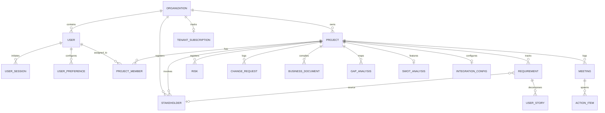

# BAHub - Phase 6: Data Analysis & Database Schema Mapping

This document details the database architecture of **BAHub**, mapping entity relationships, structural field tables, foreign key constraints, and classifying application data.

---

## 1. Entity Relationship Diagram (ERD)

The diagram below represents the logical database schema of BAHub. All entities inherit audit tracking properties (`id` UUID primary key, timestamps, `is_deleted` soft-delete flag) from the abstract `BaseModel`.

---

## 2. Master Data vs. Transaction Data

To optimize system performance and understand access patterns, BAHub classifies data into two core types:

### 2.1 Master Data (Core Entities)
This data is relatively static and defines the foundational building blocks of the workspace:
* **Organizations**: Tenant container accounts.
* **Users**: Identity profiles and system role definitions.
* **Projects**: Scoped collaboration spaces.
* **Stakeholders**: Directory of names, titles, and departments.
* **Integration Configs**: Connection details for third-party systems like Jira and Confluence.

### 2.2 Transaction Data (Operational Logs)
This data changes frequently, generated by users' daily operational actions:
* **Requirements & User Stories**: Logged specifications and Agile cards.
* **Meetings & Action Items**: Minutes of meetings and checklist items.
* **Risks & Change Requests**: Audits and approval logs.
* **SWOT & Gap Analyses**: Business analysis worksheets.
* **User Sessions**: Login logs.

---

## 3. Data Dictionary & Table Definitions

### 3.1 Table: `organizations` (Organization Model)
* **Description**: The top-level multi-tenant boundary. All project data is isolated within an organization context.
* **Fields**:

| Field Name | Data Type | Nullability | Constraints / Keys | Default Value | Description |
| :--- | :--- | :--- | :--- | :--- | :--- |
| `id` | UUID | Not Null | Primary Key | `uuid4()` | Unique organization identifier. |
| `name` | VARCHAR(255) | Not Null | Unique | - | Name of the organization. |
| `logo` | VARCHAR(100) | Nullable | - | - | Path to the uploaded logo file. |
| `description` | TEXT | Nullable | - | `""` | Optional description of the organization. |
| `timezone` | VARCHAR(100) | Not Null | - | `"UTC"` | Active timezone for organization operations. |
| `email` | VARCHAR(254) | Nullable | - | - | General contact email. |
| `phone` | VARCHAR(50) | Nullable | - | - | Contact phone number. |
| `website` | VARCHAR(200) | Nullable | - | - | URL of the organization website. |
| `address` | TEXT | Nullable | - | `""` | Physical address. |
| `created_at` | DATETIME | Not Null | - | Auto Now Add | Creation timestamp. |
| `updated_at` | DATETIME | Not Null | - | Auto Now | Last update timestamp. |
| `is_deleted` | BOOLEAN | Not Null | - | `False` | Soft delete flag. |

### 3.2 Table: `users` (Custom User Model)
* **Description**: Represents workspace accounts, linking authentication details, roles, and organization scopes.
* **Fields**:

| Field Name | Data Type | Nullability | Constraints / Keys | Default Value | Description |
| :--- | :--- | :--- | :--- | :--- | :--- |
| `id` | UUID | Not Null | Primary Key | `uuid4()` | Unique user identifier. |
| `username` | VARCHAR(150) | Not Null | Unique | - | Login username. |
| `password` | VARCHAR(128) | Not Null | - | - | Hashed password. |
| `email` | VARCHAR(254) | Not Null | - | - | User email. |
| `role` | VARCHAR(50) | Not Null | - | `"BUSINESS_ANALYST"` | Choices: `ADMIN`, `BUSINESS_ANALYST`, `PRODUCT_OWNER`, `DEVELOPER`, `QA_TESTER`, `STAKEHOLDER`. |
| `organization_id` | UUID | Nullable | Foreign Key -> `organizations(id)` | `SET_NULL` | Links user to their organization. |
| `phone` | VARCHAR(30) | Nullable | - | - | User phone number. |
| `bio` | TEXT | Nullable | - | - | User profile description. |
| `is_active` | BOOLEAN | Not Null | - | `True` | Django status flag. |
| `is_staff` | BOOLEAN | Not Null | - | `False` | Django admin access flag. |

### 3.3 Table: `projects` (Project Model)
* **Description**: Scoped collaboration spaces within an organization.
* **Fields**:

| Field Name | Data Type | Nullability | Constraints / Keys | Default Value | Description |
| :--- | :--- | :--- | :--- | :--- | :--- |
| `id` | UUID | Not Null | Primary Key | `uuid4()` | Unique project identifier. |
| `organization_id` | UUID | Not Null | Foreign Key -> `organizations(id)` | `CASCADE` | Owner organization context. |
| `name` | VARCHAR(255) | Not Null | Unique with `organization_id` | - | Project name. |
| `description` | TEXT | Nullable | - | `""` | Project description. |
| `status` | VARCHAR(50) | Not Null | - | `"ACTIVE"` | Choices: `ACTIVE`, `COMPLETED`, `ARCHIVED`. |
| `start_date` | DATE | Nullable | - | - | Planned start date. |
| `end_date` | DATE | Nullable | - | - | Target completion date. |

### 3.4 Table: `project_members` (ProjectMember Model)
* **Description**: Junction table mapping users to projects and defining project-specific roles.
* **Fields**:

| Field Name | Data Type | Nullability | Constraints / Keys | Default Value | Description |
| :--- | :--- | :--- | :--- | :--- | :--- |
| `id` | UUID | Not Null | Primary Key | `uuid4()` | Junction ID. |
| `project_id` | UUID | Not Null | Foreign Key -> `projects(id)` | `CASCADE` | Linked project. |
| `user_id` | UUID | Not Null | Foreign Key -> `users(id)` | `CASCADE` | Assigned user. |
| `role` | VARCHAR(50) | Not Null | Unique with `project_id`, `user_id` | `"CONTRIBUTOR"` | Project role. Choices: `PROJECT_MANAGER`, `CONTRIBUTOR`, `VIEWER`. |

### 3.5 Table: `stakeholders` (Stakeholder Model)
* **Description**: Registry of stakeholders involved in requirements discovery.
* **Fields**:

| Field Name | Data Type | Nullability | Constraints / Keys | Default Value | Description |
| :--- | :--- | :--- | :--- | :--- | :--- |
| `id` | UUID | Not Null | Primary Key | `uuid4()` | Stakeholder ID. |
| `organization_id` | UUID | Not Null | Foreign Key -> `organizations(id)` | `CASCADE` | Organization context. |
| `project_id` | UUID | Nullable | Foreign Key -> `projects(id)` | `CASCADE` | Optional project scoping. |
| `name` | VARCHAR(255) | Not Null | - | - | Full name of stakeholder. |
| `title` | VARCHAR(255) | Not Null | - | - | Job title (e.g. CPO, Director). |
| `department` | VARCHAR(255) | Nullable | - | `""` | Stakeholder department. |
| `email` | VARCHAR(254) | Nullable | - | - | Contact email. |
| `power` | VARCHAR(50) | Not Null | - | `"LOW"` | Choices: `HIGH`, `LOW`. |
| `interest` | VARCHAR(50) | Not Null | - | `"LOW"` | Choices: `HIGH`, `LOW`. |
| `influence` | INTEGER | Not Null | - | `3` | Score from 1 to 5. |
| `impact` | INTEGER | Not Null | - | `3` | Score from 1 to 5. |

### 3.6 Table: `requirements` (Requirement Model)
* **Description**: Detailed catalog of project specifications.
* **Fields**:

| Field Name | Data Type | Nullability | Constraints / Keys | Default Value | Description |
| :--- | :--- | :--- | :--- | :--- | :--- |
| `id` | UUID | Not Null | Primary Key | `uuid4()` | Requirement ID. |
| `project_id` | UUID | Not Null | Foreign Key -> `projects(id)` | `CASCADE` | Linked project. |
| `req_id` | VARCHAR(50) | Not Null | Unique with `project_id` | Auto-calculated | Sequential identifier (e.g. `REQ-001`). |
| `title` | VARCHAR(255) | Not Null | - | - | Brief requirement title. |
| `description` | TEXT | Not Null | - | - | Detailed specification text. |
| `req_type` | VARCHAR(50) | Not Null | - | `"FUNCTIONAL"` | Choices: `FUNCTIONAL`, `NON_FUNCTIONAL`, `TECHNICAL`, `UI`. |
| `status` | VARCHAR(50) | Not Null | - | `"DRAFT"` | Choices: `DRAFT`, `REVIEW`, `APPROVED`, `REJECTED`. |
| `priority` | VARCHAR(50) | Not Null | - | `"MEDIUM"` | Choices: `HIGH`, `MEDIUM`, `LOW`. |
| `version` | VARCHAR(20) | Not Null | - | `"1.0"` | Document version tracker. |
| `source_stakeholder_id` | UUID | Nullable | Foreign Key -> `stakeholders(id)` | `SET_NULL` | Tracing source stakeholder. |

### 3.7 Table: `user_stories` (UserStory Model)
* **Description**: Decomposed agile stories linked to parent requirements.
* **Fields**:

| Field Name | Data Type | Nullability | Constraints / Keys | Default Value | Description |
| :--- | :--- | :--- | :--- | :--- | :--- |
| `id` | UUID | Not Null | Primary Key | `uuid4()` | Story ID. |
| `requirement_id` | UUID | Not Null | Foreign Key -> `requirements(id)` | `CASCADE` | Parent requirement. |
| `story_id` | VARCHAR(50) | Not Null | Unique with `requirement_id` | Auto-calculated | Sequential story ID (e.g. `US-001`). |
| `title` | VARCHAR(255) | Not Null | - | - | Story title. |
| `role` | VARCHAR(255) | Not Null | - | - | "As a..." actor. |
| `action` | TEXT | Not Null | - | - | "I want to..." action description. |
| `benefit` | TEXT | Not Null | - | - | "So that..." benefit statement. |
| `acceptance_criteria` | TEXT | Nullable | - | `""` | Gherkin format validation scripts. |
| `status` | VARCHAR(50) | Not Null | - | `"TODO"` | Choices: `TODO`, `IN_PROGRESS`, `QA`, `DONE`. |
| `points` | INTEGER | Not Null | - | `3` | Fibonacci scale: 1, 2, 3, 5, 8, 13. |
| `jira_key` | VARCHAR(100) | Nullable | - | - | External JIRA key mapping (e.g. `PROJ-12`). |
| `jira_url` | VARCHAR(512) | Nullable | - | - | URL link to synchronized JIRA issue. |
