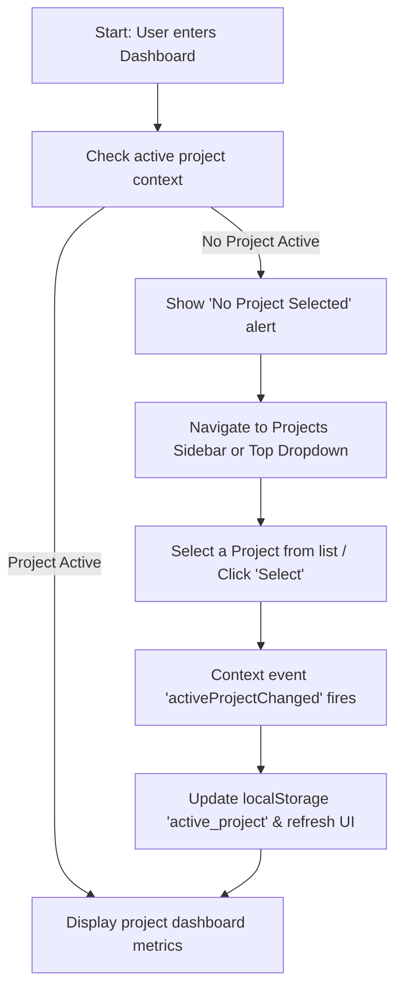
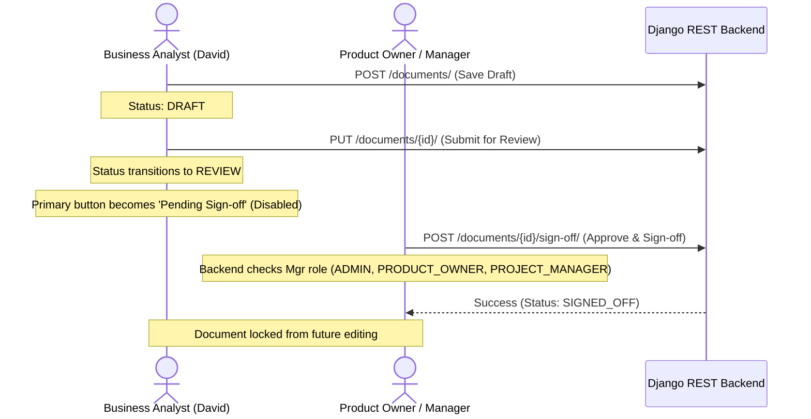

# BAHub User Journeys & Workspace Flow

This document details the end-to-end user workflows, state changes, and role-based permissions (RBAC) within the BAHub Workspace.

---

## 1. Project Selection & Context Switching

### Steps:
1. **Initial Entry**: When a user logs in, the system checks `localStorage` for an `active_project`.
2. **Alert State**: If no active project is found, the workspace prompts the user to select or create a project.
3. **Activation**: Navigating to [Projects Page](file:///c:/Users/pinja/OneDrive/Desktop/BAHub/frontend/src/features/projects/ProjectsPage.tsx) allows clicking the **Select** button. This updates the local storage context and dispatches the `activeProjectChanged` event across all open tabs, immediately updating headers, breadcrumbs, and metrics.

---

## 2. Dashboard KPI Overview & Metrics Synchronization

The dashboard aggregates indicators for the active project context:

* **Backlog Coverage**: Shows the count of `APPROVED` or `SIGNED_OFF` requirements divided by the total number of requirements in the backlog. Includes a visual progress bar.
* **Specs Generated**: Total number of business documents (BRD/FRD) compiled for the active project.
* **Draft Items**: The count of requirements still in `DRAFT` status (needs review).
* **Total Actions**: Logs audit activities (such as requirement creation, document editing, and review requests).

> [!NOTE]
> Saving edits or changing document statuses in the Document Workspace triggers the `onSave` callback, causing the dashboard metrics to immediately re-fetch and sync.

---

## 3. Document Workspace & RBAC Approval Flow

The Document Workspace allows collaborative editing of Business Requirements Documents (BRDs). Action buttons at the bottom dynamically adapt to the user's role:

### Action Workflows:
1. **Save Draft**:
   * *Allowed Roles*: All collaborators (Admins, Product Owners, Business Analysts).
   * *Behavior*: Compiles the Notion-style fields (`Scope`, `Flow`, `Requirements`) into a single markdown string and sends it as a `DRAFT` via the `/documents/` endpoint.
2. **Submit for Review (BA Role)**:
   * *Allowed Roles*: Business Analysts, Developers.
   * *Behavior*: Sends a request updating the document's status to `REVIEW`. The editor UI elements disable editing inputs, and the action button displays **Pending Sign-off** (disabled).
3. **Approve & Sign-off (Manager/Admin Role)**:
   * *Allowed Roles*: Admins, Product Owners, Project Managers.
   * *Behavior*: Direct sign-off transitions the document status to `SIGNED_OFF` using the `/sign-off/` endpoint, stamping the document with the signer's credentials and timestamp, and locking the file.
